# Práctica PaaS: Despliegue de Servicio GenAI en Azure App Service (Rama Mínimo)

Este documento detalla la estructura, generación de imagen y flujo de comandos para realizar el despliegue del servicio mínimo en **Azure App Service (PaaS)** sobre Linux. El servicio consiste en un único contenedor que expone una API desarrollada en **FastAPI** que conecta con la API de **Gemini** para procesar prompts de usuario.

---

## 1. Descripción del Despliegue (Arquitectura Mínima)

El despliegue consiste en un servicio web serverless autohospedado dentro de un contenedor Docker en la plataforma **Azure App Service (Linux Web App)**. 

### Características del despliegue:
* **Sin Persistencia:** El contenedor funciona bajo el principio de infraestructura efímera (stateless). Las solicitudes se procesan en tiempo real y no se guarda historial de las consultas en archivos locales ni bases de datos.
* **Único Contenedor:** Toda la lógica reside en una sola aplicación de FastAPI, eliminando la necesidad de proxies o bases de datos adicionales.
* **Integración GenAI:** Se conecta directamente con la API oficial de Google Gemini usando el SDK de nueva generación (`google-genai`) y la clave de API `GEMINI_API_KEY` inyectada mediante variables de entorno en la nube.
* **Infraestructura PaaS:** Se emplea un plan de App Service en Linux, ideal para albergar APIs basadas en contenedores con escalado automático de recursos.

```
                  ┌───────────────────────────────┐
                  │      Azure App Service        │
                  │   (Linux Web App Container)   │
                  │                               │
Cliente (HTTP) ──>│  ┌─────────────────────────┐  │      HTTPS
  [Port 80/443]   │  │       FastAPI App       │──┼───────────────> Google Gemini API
                  │  │       [Port 8080]       │  │ (gemini-2.5-flash)
                  │  └─────────────────────────┘  │
                  └───────────────────────────────┘
```

---

## 2. Definición del Contenedor (Dockerfile)

La imagen se construye a partir del siguiente `Dockerfile`, el cual optimiza el peso de la imagen mediante la versión `slim` de Python y aprovecha la caché de capas de Docker copiando primero las dependencias.

```dockerfile
# Use official Python slim image
FROM python:3.11-slim

# Set working directory
WORKDIR /app

# Copy requirements.txt first to leverage Docker cache
COPY requirements.txt .

# Install all dependencies from requirements.txt
RUN pip install --no-cache-dir -r requirements.txt

# Copy the FastAPI app
COPY app.py .

# Expose FastAPI port
EXPOSE 8080

# Run the app with Uvicorn
CMD ["uvicorn", "app:app", "--host", "0.0.0.0", "--port", "8080"]
```

### Código de la Aplicación (`app.py`):
El servicio expone un único endpoint `/generate` que interactúa de manera asíncrona con el modelo `gemini-2.5-flash`:

```python
# app_fastapi_prompt.py
from dotenv import load_dotenv
from fastapi import FastAPI, Query, HTTPException
from google import genai
import os

# Carga variables de entorno locales (si existen)
load_dotenv()
client = genai.Client()

app = FastAPI()

@app.get("/generate")
async def generate_content(prompt: str = Query(..., description="The prompt to send to Gemini")):
    try:
        response = client.models.generate_content(
            model="gemini-2.5-flash",
            contents=prompt,
        )
        return {"prompt": prompt, "text": response.text}
    except Exception as e:
        raise HTTPException(status_code=500, detail=str(e))
```

---

## 3. Pruebas y Validación en Local

Antes de proceder con el despliegue en la nube, se recomienda validar el correcto funcionamiento de la aplicación de manera local mediante Docker.

### Ejecución mediante Docker local
Construya la imagen localmente y levante el contenedor pasando la variable de entorno (para pruebas directas en local sin contenedor, se ha dispuesto un archivo `.env` en la raíz del proyecto que almacena la clave `GEMINI_API_KEY` de forma segura):

```powershell
# Construir la imagen local
docker build -t fastapi-gemini:local .

# Ejecutar el contenedor
docker run -d -p 8080:8080 --name fastapi-app-local -e GEMINI_API_KEY="TU_API_KEY_DE_GEMINI" fastapi-gemini:local
```

### Verificación local:
Realice una llamada de prueba desde el navegador o consola al puerto local `8080`:

```powershell
Invoke-WebRequest "http://localhost:8080/generate?prompt=Hello_Local_Testing"
```

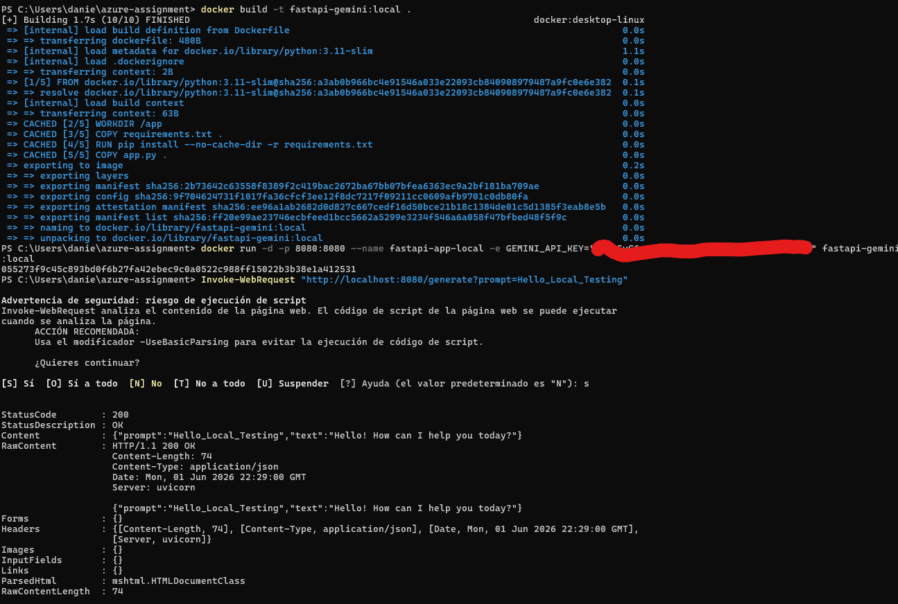

---

## 4. Guía de Pasos Realizados (Despliegue en Azure)

A continuación se presenta la secuencia completa de comandos ejecutados en la consola para registrar la imagen de contenedor y aprovisionar la infraestructura en Azure.

### Paso 1: Autenticación en Azure y definición de variables
Inicie sesión en su suscripción de Azure mediante CLI y defina las variables del entorno de trabajo:

```powershell
# Autenticarse en Azure
az login

# Definir variables de entorno para los comandos
$RESOURCE_GROUP = "gruporecursosia"
$LOCATION = "spaincentral"
$ACR_NAME = "planservicioia"
$APP_SERVICE_PLAN = "plan-fastapi-gemini"
$WEB_APP_NAME = "webapp-fastapi-gemini"
$IMAGE_TAG = "planservicioia.azurecr.io/fastapi-gemini:v1"
```

### Paso 2: Creación del Grupo de Recursos y del Azure Container Registry (ACR)
Cree un grupo de recursos donde se alojarán todos los componentes y aprovisione el registro de contenedores privado:

```powershell
# Crear el grupo de recursos
az group create --name $RESOURCE_GROUP --location $LOCATION
```

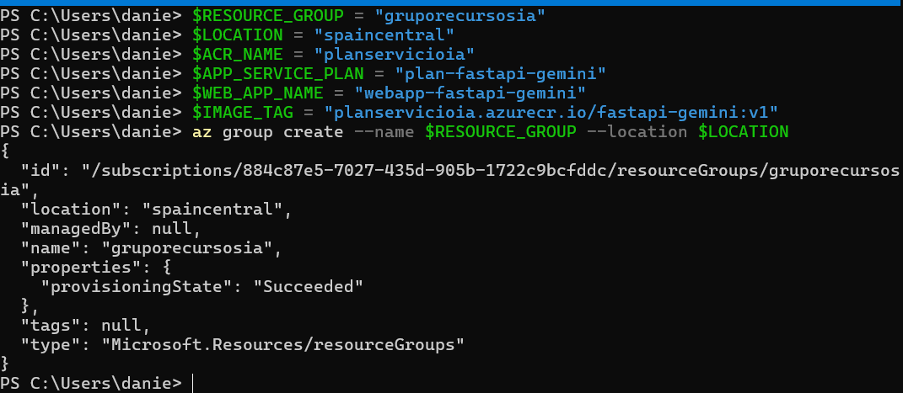

```powershell
# Crear el Azure Container Registry (SKU básico para desarrollo/pruebas)
az acr create --name $ACR_NAME --resource-group $RESOURCE_GROUP --sku Basic
```

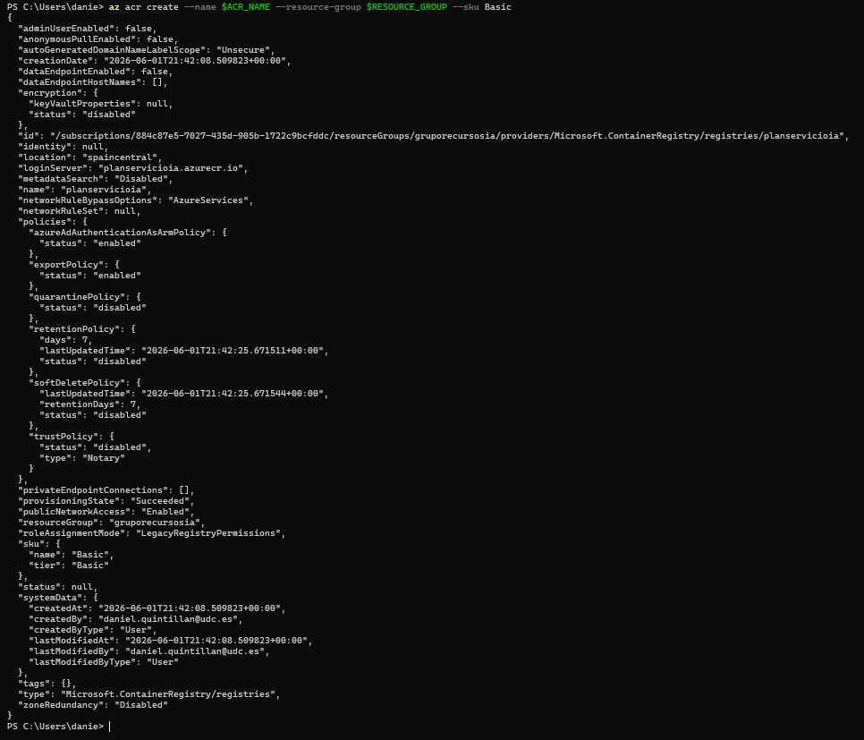

### Paso 3: Habilitar usuario administrador en ACR y autenticarse localmente
Habilite el acceso de administrador para obtener las credenciales de lectura/escritura de imágenes directamente desde Docker:

```powershell
# Habilitar usuario admin del registro
az acr update -n $ACR_NAME --admin-enabled true
```


```powershell
# Obtener la contraseña de administrador
$ACR_PASSWORD = (az acr credential show --name $ACR_NAME --query "passwords[0].value" -o tsv)

# Iniciar sesión local en Docker con las credenciales de ACR
docker login "$ACR_NAME.azurecr.io" --username $ACR_NAME --password $ACR_PASSWORD
```

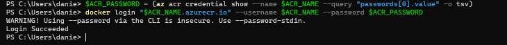

### Paso 4: Construcción y subida de la imagen Docker
Construya la imagen Docker localmente etiquetándola con la URI del registro de Azure, y súbala al repositorio:

```powershell
# Construir la imagen usando el Dockerfile de la raíz
docker build -t $IMAGE_TAG .
```

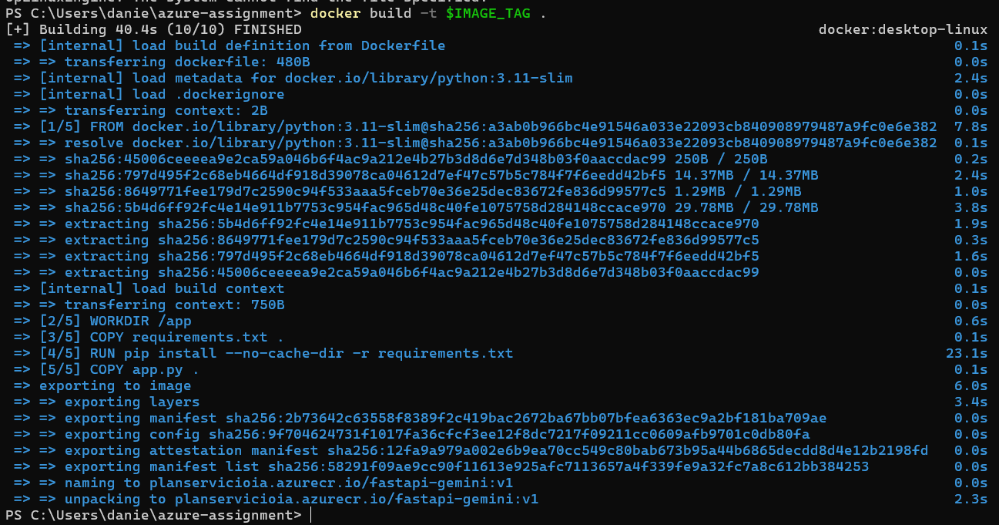

```powershell
# Subir la imagen a Azure Container Registry
docker push $IMAGE_TAG
```

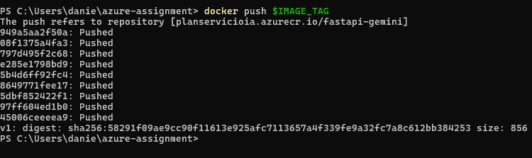

### Paso 5: Creación del Plan de App Service
Aprovisione un plan de hospedaje en Azure App Service configurado en Linux:

```powershell
# Crear el Plan de App Service (SKU B1 de Linux como nivel básico de desarrollo)
az appservice plan create --name $APP_SERVICE_PLAN --resource-group $RESOURCE_GROUP --sku B1 --is-linux
```


### Paso 6: Despliegue de la Web App desde el ACR
Aprovisione la Web App de contenedores configurando la imagen previamente cargada en el registro de Azure:

```powershell
# Crear la Web App con la imagen del contenedor de Azure
az webapp create --resource-group $RESOURCE_GROUP --plan $APP_SERVICE_PLAN --name $WEB_APP_NAME --deployment-container-image-name $IMAGE_TAG
```

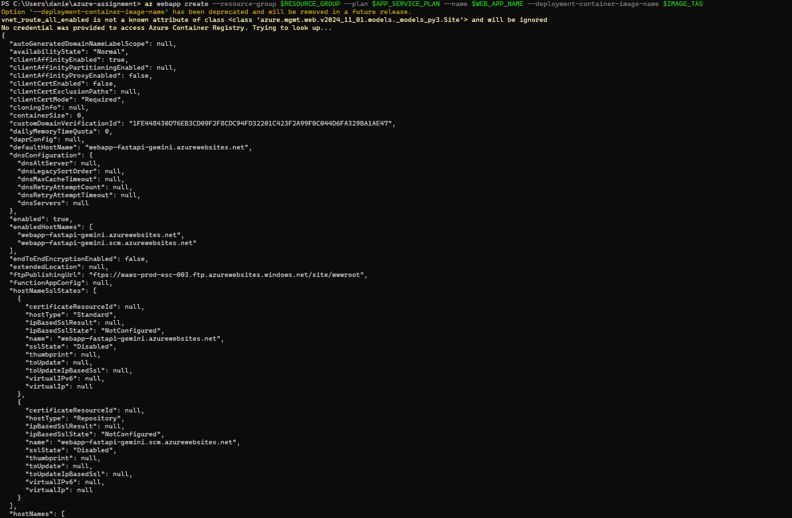

### Paso 7: Configuración de Credenciales de Registro y Variables de Entorno
Configure la autenticación del App Service contra el ACR para que pueda descargar las actualizaciones de la imagen y defina los secretos de la aplicación:

```powershell
# Vincular las credenciales del registro privado a la Web App
az webapp config container set --name $WEB_APP_NAME --resource-group $RESOURCE_GROUP --docker-custom-image-name $IMAGE_TAG --docker-registry-server-url "https://$ACR_NAME.azurecr.io" --docker-registry-server-user $ACR_NAME --docker-registry-server-password $ACR_PASSWORD

# Definir la API Key de Gemini y forzar el puerto 8080 dentro del contenedor
az webapp config appsettings set --resource-group $RESOURCE_GROUP --name $WEB_APP_NAME --settings WEBSITES_PORT=8080 GEMINI_API_KEY="TU_API_KEY_DE_GEMINI"
```

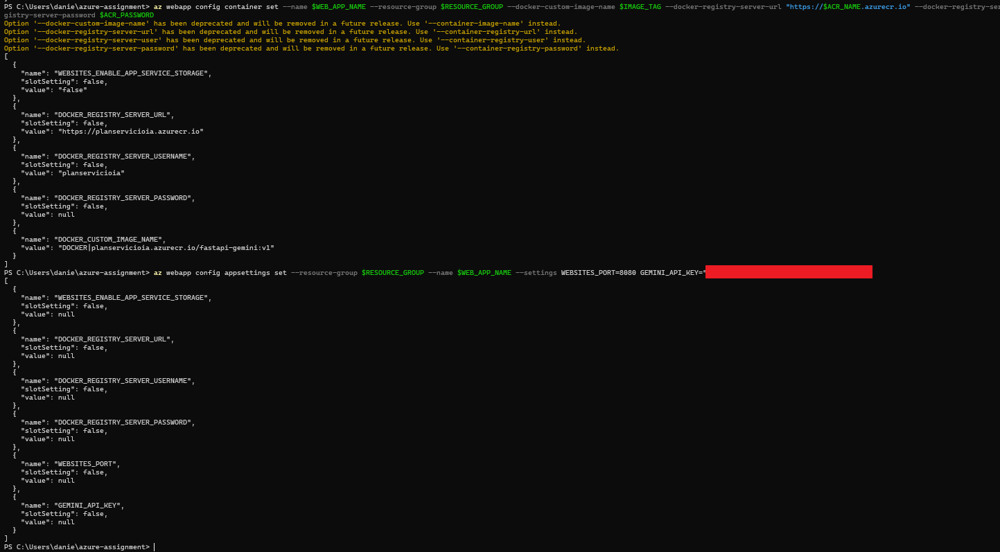

---

## 5. Verificación del Funcionamiento en Azure

Una vez que el despliegue haya completado su inicio en Azure, puede probar el endpoint de generación ejecutando la siguiente llamada HTTP desde la consola:

```powershell
# Realizar petición de prueba a la API desplegada en Azure
Invoke-WebRequest "https://$WEB_APP_NAME.azurewebsites.net/generate?prompt=Explain_PaaS_in_one_sentence"
```

### Formato esperado de respuesta:
```json
{
  "prompt": "Explain_PaaS_in_one_sentence",
  "text": "Platform as a Service (PaaS) is a cloud computing model where a third-party provider delivers hardware and software tools—usually those needed for application development—to users over the internet."
}
```

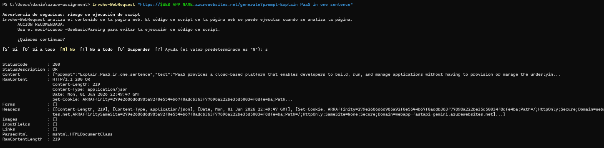

### 5.1. Limpieza de Recursos y Control de Gastos

Para evitar que los recursos aprovisionados sigan consumiendo créditos de estudiante o facturando cargos adicionales, se recomienda gestionar el ciclo de vida de los servicios mediante una de las siguientes opciones:

Si deseas conservar la configuración de la Web App pero detener la ejecución del contenedor:
```powershell
# Detener la Web App
az webapp stop --name $WEB_APP_NAME --resource-group $RESOURCE_GROUP

# Volver a iniciar el servicio cuando sea necesario
az webapp start --name $WEB_APP_NAME --resource-group $RESOURCE_GROUP
```
## 6. Referencias y Bibliografía

Para la elaboración de este despliegue y la configuración de los comandos, se han consultado las siguientes fuentes de documentación oficial:

### Documentación de Azure CLI (Microsoft Learn):
* [az group (Administración de Grupos de Recursos)](https://learn.microsoft.com/cli/azure/group)
* [az acr (Gestión de Azure Container Registry)](https://learn.microsoft.com/cli/azure/acr)
* [az appservice plan (Configuración de Planes de App Service)](https://learn.microsoft.com/cli/azure/appservice/plan)
* [az webapp (Creación y Gestión de Web Apps)](https://learn.microsoft.com/cli/azure/webapp)
* [az webapp config container (Configuración de Contenedores en Web Apps)](https://learn.microsoft.com/cli/azure/webapp/config/container)
* [az webapp config appsettings (Definición de Variables de Entorno y Configuración)](https://learn.microsoft.com/cli/azure/webapp/config/appsettings)

### Documentación de Docker:
* [Referencia de la Línea de Comandos de Docker (build, push, run)](https://docs.docker.com/engine/reference/commandline/cli/)
* [Guía de Referencia del Archivo Dockerfile](https://docs.docker.com/engine/reference/builder/)

### Librerías y SDKs:
* [Documentación Oficial de FastAPI (Framework Web)](https://fastapi.tiangolo.com/)
* [SDK de Google GenAI para Python (Gemini 2.5)](https://github.com/googleapis/python-genai)

---

## 7. Despliegue Multi-Contenedor (Docker Compose)

Opcionalmente, la aplicación se puede estructurar en una arquitectura de múltiples contenedores coordinados por Docker Compose. Esta arquitectura divide el monolito en:
1. **Frontend API (Gateway):** Un contenedor FastAPI en el puerto 80 que recibe todas las peticiones externas y las redirige hacia la capa interna.
2. **Backend API:** El contenedor FastAPI original en el puerto 8080 que se comunica exclusivamente con la API de Gemini, protegido del exterior.

### 7.1. Estructura de Docker Compose

En la raíz del proyecto se ha introducido un archivo `docker-compose.yml` que orquesta ambos servicios. Este archivo ya cuenta con el nombre y URL de su ACR resuelto directamente en las imágenes, por lo que no requiere sustitución dinámica de variables:

```yaml
version: '3.8'

services:
  backend:
    build: ./backend
    image: planservicioia.azurecr.io/fastapi-backend:v1
    environment:
      - GEMINI_API_KEY=${GEMINI_API_KEY}
    expose:
      - "8080"

  frontend:
    build: ./frontend
    image: planservicioia.azurecr.io/fastapi-frontend:v1
    environment:
      - BACKEND_URL=http://backend:8080
    ports:
      - "80:80"
    depends_on:
      - backend
```

### 7.2. Pruebas Locales (Docker Compose)

En lugar de construir una sola imagen, utilice compose para levantar el cluster entero simultáneamente:

```powershell
$env:GEMINI_API_KEY="TU_API_KEY_DE_GEMINI"
docker-compose up --build -d
```
Verifique apuntando al puerto 80 (el cual ahora es gestionado por el Gateway frontend):
```powershell
Invoke-WebRequest "http://localhost:80/generate?prompt=Prueba_Compose"
```


### 7.3. Despliegue en Azure App Service Multi-Container

Para desplegar la aplicación en Azure usando esta topología, tras haberse autenticado y creado su ACR y Plan de App Service (Pasos 1 al 3 de la guía principal), los comandos a ejecutar cambian ligeramente:

**A. Construcción y subida de ambas imágenes al ACR**
```powershell
# Exportamos el nombre del ACR para los tags del Compose
$env:ACR_NAME=$ACR_NAME

# Construimos y subimos las imágenes
docker-compose build
docker-compose push
```

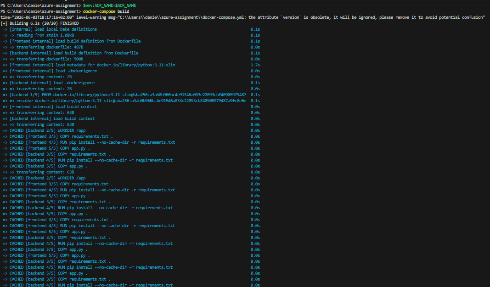


**B. Aprovisionamiento de la Web App en modo Multi-Container**
```powershell
# Crear el App Service Plan (si no lo tienes creado del ejercicio anterior)
az appservice plan create --name $APP_SERVICE_PLAN --resource-group $RESOURCE_GROUP --sku B1 --is-linux

# Crear la Web App pasándole el docker-compose.yml directamente
az webapp create --resource-group $RESOURCE_GROUP --plan $APP_SERVICE_PLAN --name $WEB_APP_NAME --multicontainer-config-type compose --multicontainer-config-file docker-compose.yml
```


**C. Configuración de Variables en Azure**
```powershell
# Vincular las credenciales del ACR a la Web App
az webapp config container set --name $WEB_APP_NAME --resource-group $RESOURCE_GROUP --docker-registry-server-url "https://$ACR_NAME.azurecr.io" --docker-registry-server-user $ACR_NAME --docker-registry-server-password $ACR_PASSWORD

# Definir la API Key de Gemini
az webapp config appsettings set --resource-group $RESOURCE_GROUP --name $WEB_APP_NAME --settings GEMINI_API_KEY="TU_API_KEY_DE_GEMINI"

# Configurar el puerto público: Indicamos a Azure que envíe el tráfico al puerto 80 (Frontend)
az webapp config appsettings set --resource-group $RESOURCE_GROUP --name $WEB_APP_NAME --settings WEBSITES_PORT=80

# Configurar comunicación interna: En Azure Multi-container los contenedores se comunican por localhost
az webapp config appsettings set --resource-group $RESOURCE_GROUP --name $WEB_APP_NAME --settings BACKEND_URL="http://localhost:8080"

# Iniciar la Web App (asegura el arranque si la aplicación está detenida)
az webapp start --name $WEB_APP_NAME --resource-group $RESOURCE_GROUP
```

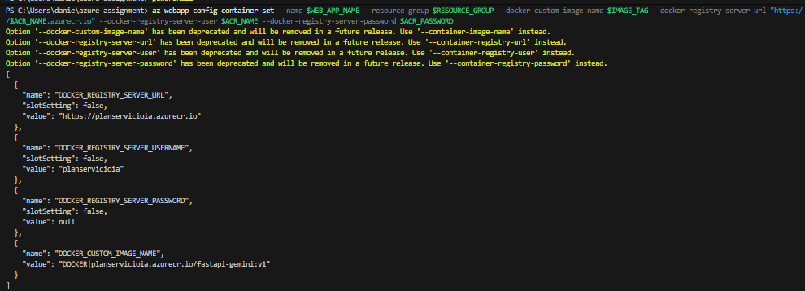


**D. Prueba del Despliegue en Azure**
Una vez que App Service haya descargado las imágenes y levantado los contenedores (esto puede tomar 2-3 minutos la primera vez), puedes probar que el flujo multi-contenedor funciona haciendo una llamada a tu dominio `.azurewebsites.net`:

```powershell
# Realizar petición de prueba a la API Frontend desplegada
Invoke-WebRequest "https://$WEB_APP_NAME.azurewebsites.net/generate?prompt=Test_Compose_Azure"
```

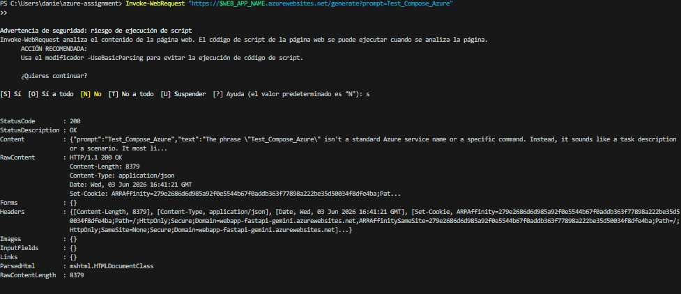

*(Nota: Si obtienes un error inicial o un tiempo de espera agotado, espera un par de minutos a que los contenedores terminen de arrancar o ejecuta `az webapp restart --name $WEB_APP_NAME --resource-group $RESOURCE_GROUP` para forzar un reinicio).*

*(Nota para actualizaciones: Si realizas modificaciones en el archivo `docker-compose.yml` localmente y deseas subirlas a Azure, debes volver a cargar la configuración en la Web App ejecutando: `az webapp config container set --resource-group $RESOURCE_GROUP --name $WEB_APP_NAME --multicontainer-config-type compose --multicontainer-config-file docker-compose.yml`).*


### 7.4. Solución de Problemas y Cambios de Código (Troubleshooting)

Durante la migración a la arquitectura multi-contenedor, nos encontramos con varios errores que requirieron los siguientes ajustes en el código y en Azure:

#### 1. Tolerancia a fallos en el Backend (`backend/app.py`)
**Problema:** Si la variable `GEMINI_API_KEY` no se pasaba correctamente (o tardaba en inyectarse), la llamada a `genai.Client()` fallaba y el contenedor `backend` crasheaba en el arranque, provocando que el Frontend no pudiera conectarse.
**Solución:** Se envolvió la inicialización en un bloque `try/except` para que el contenedor siempre arranque y devuelva el error gracefully al usuario.
```python
try:
    client = genai.Client()
except Exception as e:
    client = None
    print(f"Warning: genai.Client initialization failed: {e}")
```

#### 2. Timeout y Traza de Errores en Frontend (`frontend/app.py`)
**Problema:** Las peticiones desde el frontend al backend sufrían timeouts silenciosos si Gemini tardaba en responder, devolviendo un error `{"detail": ""}` incomprensible.
**Solución:** Se añadió un `timeout=60.0` explícito en `httpx.AsyncClient(timeout=60.0)` y se cambió la captura de excepciones para usar `repr(e)` y devolver detalles claros:
```python
    except Exception as e:
        raise HTTPException(status_code=500, detail=repr(e))
```

#### 3. Soporte de variables en Docker Compose (Azure App Service)
**Problema:** Azure App Service Multi-container no soporta el formato `${ACR_NAME}` en la propiedad `image:` del archivo de compose (provocaba el error `Application Error`).
**Solución:** Se añadió un script de PowerShell en el aprovisionamiento para inyectar estáticamente el valor y crear un `docker-compose-azure.yml` limpio.
```powershell
(Get-Content docker-compose.yml) -replace '\$\{ACR_NAME:-[^\}]*\}', $ACR_NAME | Set-Content docker-compose-azure.yml
```

#### 4. Enrutamiento del puerto público en Azure
**Problema:** En el despliegue de un solo contenedor, Azure enrutaba el tráfico al puerto 8080 (`WEBSITES_PORT=8080`). Al cambiar a multi-contenedor, nuestro nuevo Frontend público escucha por el puerto 80, provocando un fallo en el balanceador.
**Solución:** Se forzó el reseteo de la variable `WEBSITES_PORT` para redirigir el tráfico externo correctamente al puerto 80.
```powershell
az webapp config appsettings set --resource-group $RESOURCE_GROUP --name $WEB_APP_NAME --settings WEBSITES_PORT=80
```

#### 5. Comunicación de red interna entre contenedores en Azure
**Problema:** Localmente los contenedores se comunicaban vía `http://backend:8080`, pero en Azure fallaba con `ConnectError`. Esto ocurre porque Azure Web App For Containers (Compose) hace que todos los contenedores compartan el mismo espacio de red (namespaces).
**Solución:** Se modificó la URL del backend en Azure para que el Frontend llamara a `localhost` en lugar del nombre del servicio.
```powershell
az webapp config appsettings set --resource-group $RESOURCE_GROUP --name $WEB_APP_NAME --settings BACKEND_URL="http://localhost:8080"
```

#### 6. Extracción y análisis de logs en Azure
**Problema:** Durante los errores `:( Application Error`, la consola local no provee información de por qué fallaron los contenedores en el despliegue.
**Solución:** Usamos comandos de la CLI de Azure para diagnosticar qué ocurría internamente. Para descargar todos los logs como un archivo ZIP local usamos:
```powershell
az webapp log download --name $WEB_APP_NAME --resource-group $RESOURCE_GROUP
```
Adicionalmente, para ver los logs en tiempo real por la consola (muy útil durante arranques lentos o reinicios):
```powershell
az webapp log tail --name $WEB_APP_NAME --resource-group $RESOURCE_GROUP
```

## 8. Persistencia con Azure Files

Para asegurar que las consultas realizadas a la aplicación no se pierdan cuando se reinician los contenedores o se vuelve a desplegar el servicio en la nube, se ha implementado un mecanismo de almacenamiento persistente montando un recurso compartido de archivos de Azure (Azure File Share) directamente en los contenedores.

El servicio Backend guarda cada prompt en formato de texto plano dentro de la ruta `/app/data/history.txt`. Esta ruta está mapeada a un almacenamiento externo y permanente.

### 8.1. Aprovisionamiento de Azure Files y Conexión con la Web App

Sigue estos pasos en la terminal PowerShell para crear el almacenamiento persistente y conectarlo a tu Web App:

##### Paso 1: Definir variables de entorno adicionales
```powershell
# Variables para el almacenamiento persistente
$STORAGE_ACCOUNT = "almacenamientoappia" # Debe ser un nombre único globalmente
$SHARE_NAME = "archivos-texto"
$MOUNT_PATH = "/app/data" # Ruta dentro del contenedor donde se guardará el historial
```

##### Paso 2: Crear la Infraestructura de Almacenamiento
```powershell
# 1. Crear la Cuenta de Almacenamiento (Storage Account)
az storage account create --name $STORAGE_ACCOUNT --resource-group $RESOURCE_GROUP --location $LOCATION --sku Standard_LRS

# 2. Crear el recurso compartido de archivos (File Share)
az storage share-rm create --resource-group $RESOURCE_GROUP --storage-account $STORAGE_ACCOUNT --name $SHARE_NAME --quota 5
```

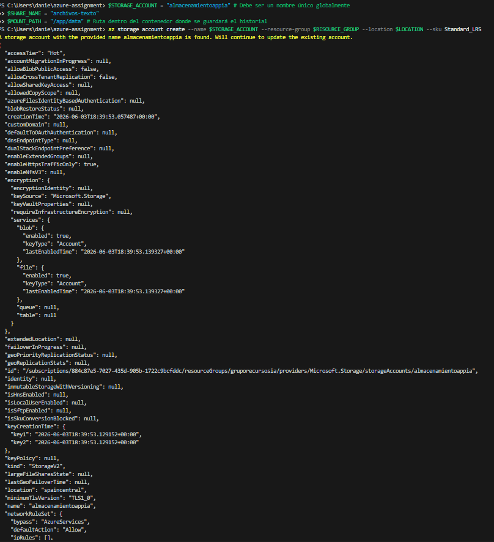

##### Paso 3: Conectar el Almacenamiento a la Web App
```powershell
# 1. Obtener la clave de acceso del Storage Account
$STORAGE_KEY = (az storage account keys list --resource-group $RESOURCE_GROUP --account-name $STORAGE_ACCOUNT --query "[0].value" --output tsv)

# 2. (Opcional) Eliminar un montaje previo con el mismo ID si existe
az webapp config storage-account delete --resource-group $RESOURCE_GROUP --name $WEB_APP_NAME --custom-id AlmacenamientoPersistente

# 3. Montar el almacenamiento persistente en la Web App
az webapp config storage-account add --resource-group $RESOURCE_GROUP --name $WEB_APP_NAME --custom-id AlmacenamientoPersistente --storage-type AzureFiles --account-name $STORAGE_ACCOUNT --share-name $SHARE_NAME --access-key $STORAGE_KEY --mount-path $MOUNT_PATH
```


---

### 8.2. Ajuste al Docker Compose (`docker-compose.yml`)

Para soportar las pruebas y persistencia en local, se ha modificado la definición del servicio `backend` en el archivo `docker-compose.yml` agregando la sección `volumes`:

```yaml
  backend:
    build: ./backend
    image: planservicioia.azurecr.io/fastapi-backend:v2
    environment:
      - GEMINI_API_KEY=${GEMINI_API_KEY}
    expose:
      - "8080"
    volumes:
      - AlmacenamientoPersistente:/app/data

# Definición del volumen al final del archivo
volumes:
  AlmacenamientoPersistente:
```
* **En Local:** docker-compose crea y gestiona automáticamente un volumen local llamado `AlmacenamientoPersistente` que se monta en `/app/data` y persiste los datos de tus consultas.
* **En Azure:** Azure App Service intercepta el nombre del volumen (`AlmacenamientoPersistente`) y lo asocia automáticamente con el montaje de Azure Files que tiene el mismo `custom-id` (Paso 3), guardando el archivo de texto directamente en la cuenta de almacenamiento en la nube sin depender del almacenamiento efímero del contenedor.

---

### 8.3. Pruebas de Persistencia en Local

1. Levanta los contenedores en local:
   ```powershell
   docker-compose up --build -d
   ```
2. Envía prompts de prueba al endpoint público de generación (puerto 80):
   ```powershell
   Invoke-WebRequest "http://localhost:80/generate?prompt=Local_Prompt_1"
   Invoke-WebRequest "http://localhost:80/generate?prompt=Local_Prompt_2"
   ```
3. Verifica que se ha creado el historial accediendo al endpoint `/history`:
   ```powershell
   (Invoke-WebRequest "http://localhost:80/history").Content
   # Salida esperada: {"history":["Local_Prompt_1"]}
   ```


4. Detén y elimina por completo los contenedores:
   ```powershell
   docker-compose down
   ```
5. Vuelve a levantar el servicio:
   ```powershell
   docker-compose up -d
   ```
6. Consulta nuevamente el historial.
   ```powershell
   (Invoke-WebRequest "http://localhost:80/history").Content
   # Salida esperada: {"history":["Local_Prompt_1"]}
   ```
Los datos deben seguir presentes puesto que están guardados en el archivo `./data/history.txt` de tu equipo local y sobreviven a la recreación de los contenedores.

---

### 8.4. Pruebas de Persistencia en Azure

1. Reconstruye y sube las imágenes al ACR con los nuevos cambios de código:
   ```powershell
   $env:ACR_NAME=$ACR_NAME
   docker-compose build
   docker-compose push
   ```
2. Forza un reinicio de la Web App en Azure para aplicar la configuración de almacenamiento y descargar las nuevas imágenes:
   ```powershell
   az webapp restart --name $WEB_APP_NAME --resource-group $RESOURCE_GROUP
   ```
3. Envía una consulta a la Web App en la nube:
   ```powershell
   Invoke-WebRequest "https://$WEB_APP_NAME.azurewebsites.net/generate?prompt=Azure_Prompt_1"
   ```
4. Consulta el endpoint de historial para comprobar que ha registrado la consulta:
   ```powershell
   (Invoke-WebRequest "https://$WEB_APP_NAME.azurewebsites.net/history").Content
   # Salida esperada: {"history":["Azure_Prompt_1"]}
   ```
5. Forza un reinicio de la Web App en Azure para simular un fallo o actualización del servicio:
   ```powershell
   az webapp restart --name $WEB_APP_NAME --resource-group $RESOURCE_GROUP
   ```
6. Vuelve a realizar la consulta al historial:
   ```powershell
   (Invoke-WebRequest "https://$WEB_APP_NAME.azurewebsites.net/history").Content
   ```
   **Resultado:** El endpoint debe seguir devolviendo `{"history":["Azure_Prompt_1"]}` demostrando que el archivo se almacena en el volumen persistente de Azure Files y no se pierde tras reiniciar el servicio.

   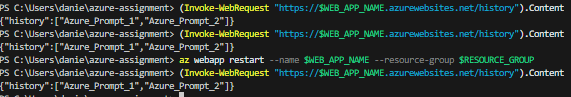

   *(Nota: Es posible que aparezcan más entradas en la lista del historial si ya habías lanzado peticiones de prueba anteriormente).*
