# Práctica PaaS: Despliegue de Servicio GenAI en Azure App Service (Rama Mínimo)

Este documento detalla la estructura, generación de imagen y flujo de comandos para realizar el despliegue del servicio mínimo en **Azure App Service (PaaS)** sobre Linux. El servicio consiste en un único contenedor que expone una API desarrollada en **FastAPI** que conecta con la API de **Gemini** para procesar prompts de usuario.

---

## Componentes Azure Necesarios

Para llevar a cabo el despliegue de esta arquitectura en la nube, se requieren los siguientes componentes de **Microsoft Azure**:

* **Grupo de Recursos (Resource Group):** Contenedor lógico que agrupa todos los recursos relacionados con este despliegue para facilitar su administración y eliminación conjunta.
* **Azure Container Registry (ACR):** Registro privado de Docker en Azure donde se compilan, almacenan y gestionan las imágenes de los contenedores (`backend` y `frontend`).
* **Plan de App Service (App Service Plan):** Define los recursos físicos de computación y el sistema operativo (Linux con SKU B1) sobre los que correrá la aplicación.
* **Azure App Service (Web App for Containers):** Servicio PaaS que ejecuta la aplicación web a partir de la configuración multi-contenedor definida en el archivo `docker-compose.yml`.
* **Cuenta de Almacenamiento (Storage Account):** Servicio que aloja y gestiona las capacidades de almacenamiento en la nube requeridas para el proyecto.
* **Azure Files (File Share):** Recurso compartido de archivos montado como volumen persistente en la Web App (mapeado a `/app/data`) para salvaguardar el archivo de logs `history.txt` y asegurar su persistencia tras reinicios de los contenedores.

---

## URLs del Servicio Desplegado en Azure

> **ℹ️ Nota:** Todos los bloques de este documento comparten la misma Web App de Azure (`webapp-fastapi-gemini`), actualizándose iterativamente. La URL base es única y permanece constante a través de las distintas versiones desplegadas.

| Endpoint | URL | Descripción |
|---|---|---|
| Generación de contenido | [`https://webapp-fastapi-gemini.azurewebsites.net/generate?prompt=...`](https://webapp-fastapi-gemini.azurewebsites.net/generate?prompt=Hello) | Envía un prompt a Gemini y devuelve la respuesta |
| Historial de logs | [`https://webapp-fastapi-gemini.azurewebsites.net/logs`](https://webapp-fastapi-gemini.azurewebsites.net/logs) | Devuelve el historial de comunicaciones Frontend→Backend (disponible desde Bloque 4) |

---

## Descripción de los Despliegues

La práctica implementa un servicio de Inteligencia Artificial Generativa (GenAI) basado en la API de **Google Gemini**, desplegado de forma iterativa en **Azure App Service (PaaS)** a través de cuatro bloques de complejidad creciente:

| Bloque | Tipo | Descripción resumida |
|---|---|---|
| **1** | Contenedor único | Una sola imagen FastAPI que recibe prompts del usuario y los envía directamente a la API de Gemini. Sin persistencia, sin proxy. Se despliega en Azure App Service (Linux) usando Azure Container Registry (ACR). |
| **2** | Docker Compose — 2 contenedores | Se divide en un **Frontend** (gateway público en puerto 80) y un **Backend** (procesador Gemini en puerto 8080, sin exposición directa al exterior). El Frontend enruta las peticiones al Backend internamente. Despliegue multi-contenedor en Azure App Service. |
| **3** | Compose + Persistencia (backend) | Sobre el Bloque 2, el Backend guarda cada prompt en un archivo `history.txt` montado sobre **Azure Files** (File Share). El historial sobrevive a reinicios y reempliegues gracias al volumen persistente. |
| **4** | Compose + Persistencia (frontend) + Logs | El Frontend pasa a ser el responsable de registrar logs de comunicación (URL llamada, respuesta recibida) en `history.txt`. El volumen persistente se traslada al Frontend. Se añade el endpoint `/logs` para consultar el historial. Es la arquitectura final desplegada. |

Todos los bloques utilizan imágenes propias construidas desde cero (no se usa DockerHub) y almacenadas en el **Azure Container Registry** `planservicioia.azurecr.io`.

---

## Prerrequisitos del Entorno

Antes de comenzar a ejecutar los comandos de despliegue o pruebas locales, asegúrate de contar con los siguientes elementos instalados y configurados en tu equipo:

### 1. Docker Desktop
* **Uso:** Construcción, etiquetado y ejecución de contenedores locales, así como publicación de imágenes en el registro privado.
* **Instalación:** Descarga e instala [Docker Desktop para Windows](https://www.docker.com/products/docker-desktop/).
* **Verificación:** Ejecuta el siguiente comando en PowerShell para verificar que el servicio está activo:
  ```powershell
  docker info
  ```
* **Inicio rápido (si no está activo):** Si Docker no se está ejecutando, puedes iniciarlo desde el menú de inicio de Windows o por PowerShell:
  ```powershell
  Start-Process "C:\Program Files\Docker\Docker\Docker Desktop.exe"
  ```
  *Espera a que el icono de Docker en la barra de tareas muestre "Docker Desktop is running" antes de continuar.*

### 2. Azure CLI
* **Uso:** Administración, creación y configuración de toda la infraestructura PaaS (Azure App Service, Azure Container Registry, Azure Files).
* **Instalación:** Sigue la [guía de instalación de Azure CLI para Windows](https://learn.microsoft.com/cli/azure/install-azure-cli-windows).
* **Verificación:** Ejecuta el siguiente comando en PowerShell para confirmar que está instalado correctamente:
  ```powershell
  az --version
  ```

---

## Bloque 1: Despliegue de un Contenedor

### 1.1. Descripción del Despliegue (Arquitectura Mínima)

El despliegue consiste en un servicio web gestionado en contenedor dentro de la plataforma **Azure App Service (Linux Web App)**. 

### Características del despliegue:
* **Sin Persistencia:** El contenedor funciona bajo el principio de infraestructura efímera (stateless). Las solicitudes se procesan en tiempo real y no se guarda historial de las consultas en archivos locales ni bases de datos.
* **Único Contenedor:** Toda la lógica reside en una sola aplicación de FastAPI, eliminando la necesidad de proxies o bases de datos adicionales.
* **Integración GenAI:** Se conecta directamente con la API oficial de Google Gemini usando el SDK de nueva generación (`google-genai`) y la clave de API `GEMINI_API_KEY` inyectada mediante variables de entorno en la nube.
* **Infraestructura PaaS:** Se emplea un plan de App Service en Linux, ideal para albergar APIs basadas en contenedores con escalado automático de recursos.

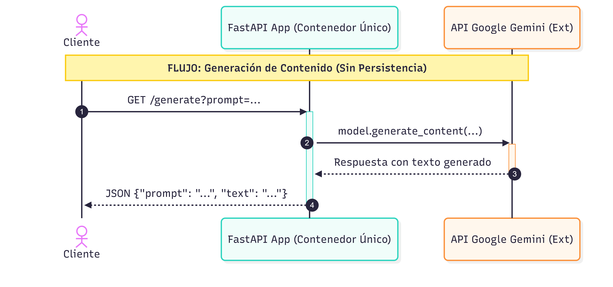

---

### 1.2. Definición del Contenedor (Dockerfile)

La imagen se construye a partir del siguiente `Dockerfile`, el cual optimiza el peso de la imagen mediante la versión `slim` de Python y aprovecha la caché de capas de Docker copiando primero las dependencias.

```dockerfile
# Use official Python slim image
FROM python:3.11-slim

# Set working directory
WORKDIR /app

# Copy requirements.txt first to leverage Docker cache
COPY requirements.txt .

# Install all dependencies from requirements.txt
RUN pip install --no-cache-dir -r requirements.txt

# Copy the FastAPI app
COPY app.py .

# Expose FastAPI port
EXPOSE 8080

# Run the app with Uvicorn
CMD ["uvicorn", "app:app", "--host", "0.0.0.0", "--port", "8080"]
```

#### Código de la Aplicación (`app.py`):
El servicio expone un único endpoint `/generate` que interactúa de manera asíncrona con el modelo `gemini-2.5-flash`:

```python
# app_fastapi_prompt.py
from dotenv import load_dotenv
from fastapi import FastAPI, Query, HTTPException
from google import genai
import os

# Carga variables de entorno locales (si existen)
load_dotenv()
client = genai.Client()

app = FastAPI()

@app.get("/generate")
async def generate_content(prompt: str = Query(..., description="The prompt to send to Gemini")):
    try:
        response = client.models.generate_content(
            model="gemini-2.5-flash",
            contents=prompt,
        )
        return {"prompt": prompt, "text": response.text}
    except Exception as e:
        raise HTTPException(status_code=500, detail=str(e))
```

---

### 1.3. Pruebas y Validación en Local

Antes de proceder con el despliegue en la nube, se recomienda validar el correcto funcionamiento de la aplicación de manera local mediante Docker.

> **⚠️ Prerequisito:** Asegúrate de que **Docker Desktop** está arrancado antes de ejecutar cualquier comando `docker`. Puedes iniciarlo desde el menú de inicio de Windows o ejecutando `Start-Process "C:\Program Files\Docker\Docker\Docker Desktop.exe"` en PowerShell. Espera a que el icono de Docker en la barra de tareas muestre el mensaje *"Docker Desktop is running"* antes de continuar.

#### Ejecución mediante Docker local
Construye la imagen localmente y levanta el contenedor pasando la variable de entorno (para ejecución directa sin Docker, existe un archivo `.env` en la raíz del proyecto con la clave `GEMINI_API_KEY`):

```powershell
# Leer la API Key desde el archivo .env (evita exponer la clave en el historial de comandos)
$env:GEMINI_API_KEY = (Get-Content .env | Select-String "GEMINI_API_KEY" | ForEach-Object { $_.ToString().Split("=",2)[1] })

# Construir la imagen local
docker build -t fastapi-gemini:local .

# Ejecutar el contenedor
docker run -d -p 8080:8080 --name fastapi-app-local -e GEMINI_API_KEY=$env:GEMINI_API_KEY fastapi-gemini:local
```

#### Verificación local:
Realiza una llamada de prueba desde el navegador o consola al puerto local `8080`:

```powershell
Invoke-WebRequest "http://localhost:8080/generate?prompt=Hello_Local_Testing" -UseBasicParsing
```

> **ℹ️ Nota sobre PowerShell:** Se añade el parámetro `-UseBasicParsing` en todos los comandos `Invoke-WebRequest` de esta práctica para evitar que PowerShell intente inicializar el motor de Internet Explorer (lo cual suele lanzar una advertencia de seguridad interactiva y requerir confirmación del usuario para continuar).

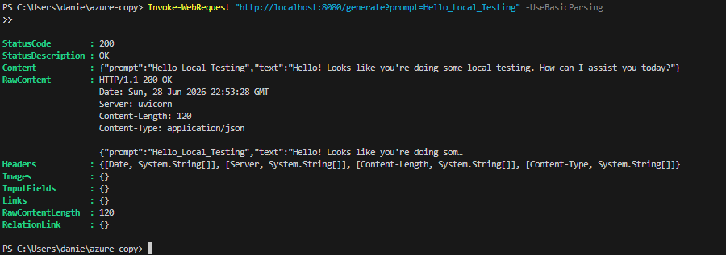

---

### 1.4. Guía de Pasos Realizados (Despliegue en Azure)

A continuación se presenta la secuencia completa de comandos ejecutados en la consola para registrar la imagen de contenedor y aprovisionar la infraestructura en Azure.

#### Paso 1: Autenticación en Azure y definición de variables
Inicia sesión en tu suscripción de Azure mediante CLI y define las variables del entorno de trabajo:

```powershell
# Autenticarse en Azure
az login

# Definir variables de entorno para los comandos
$RESOURCE_GROUP = "gruporecursosia"
$LOCATION = "spaincentral"
$ACR_NAME = "planservicioia"
$APP_SERVICE_PLAN = "plan-fastapi-gemini"
$WEB_APP_NAME = "webapp-fastapi-gemini"
$IMAGE_TAG = "planservicioia.azurecr.io/fastapi-gemini:v1"
```

#### Paso 2: Creación del Grupo de Recursos y del Azure Container Registry (ACR)
Crea un grupo de recursos donde se alojarán todos los componentes y aprovisiona el registro de contenedores privado:

```powershell
# Crear el grupo de recursos
az group create --name $RESOURCE_GROUP --location $LOCATION
```

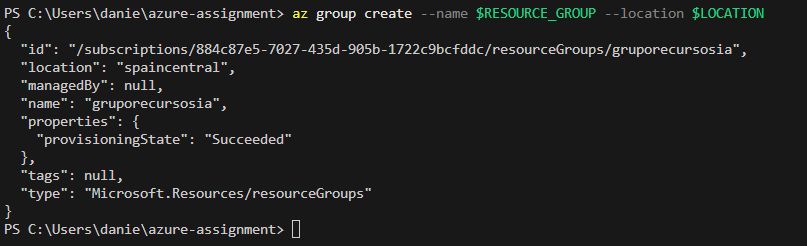

```powershell
# Crear el Azure Container Registry (SKU básico para desarrollo/pruebas)
az acr create --name $ACR_NAME --resource-group $RESOURCE_GROUP --sku Basic
```


#### Paso 3: Habilitar usuario administrador en ACR y autenticarse localmente
Habilita el acceso de administrador para obtener las credenciales de lectura/escritura de imágenes directamente desde Docker:

```powershell
# Habilitar usuario admin del registro
az acr update -n $ACR_NAME --admin-enabled true
```

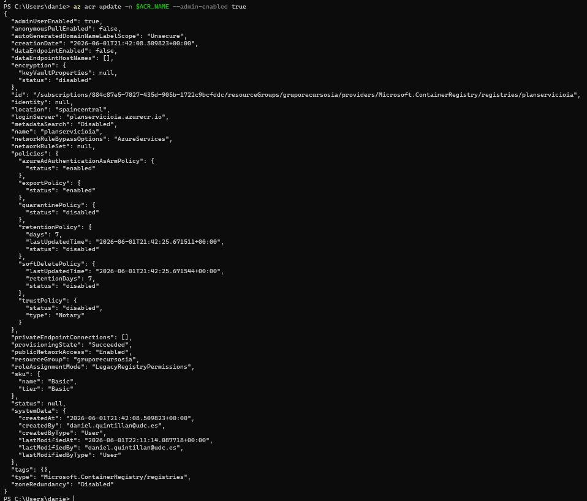

```powershell
# Obtener la contraseña de administrador
$ACR_PASSWORD = (az acr credential show --name $ACR_NAME --query "passwords[0].value" -o tsv)

# Iniciar sesión local en Docker con las credenciales de ACR (usando password-stdin por seguridad)
echo $ACR_PASSWORD | docker login "$ACR_NAME.azurecr.io" --username $ACR_NAME --password-stdin
```

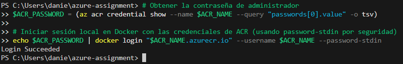

#### Paso 4: Construcción y subida de la imagen Docker
Construye la imagen Docker localmente etiquetándola con la URI del registro de Azure, y súbela al repositorio:

```powershell
# Construir la imagen usando el Dockerfile de la raíz
docker build -t $IMAGE_TAG .
```


```powershell
# Subir la imagen a Azure Container Registry
docker push $IMAGE_TAG
```


#### Paso 5: Creación del Plan de App Service
Aprovisiona un plan de hospedaje en Azure App Service configurado en Linux:

```powershell
# Crear el Plan de App Service (SKU B1 de Linux como nivel básico de desarrollo)
az appservice plan create --name $APP_SERVICE_PLAN --resource-group $RESOURCE_GROUP --sku B1 --is-linux
```

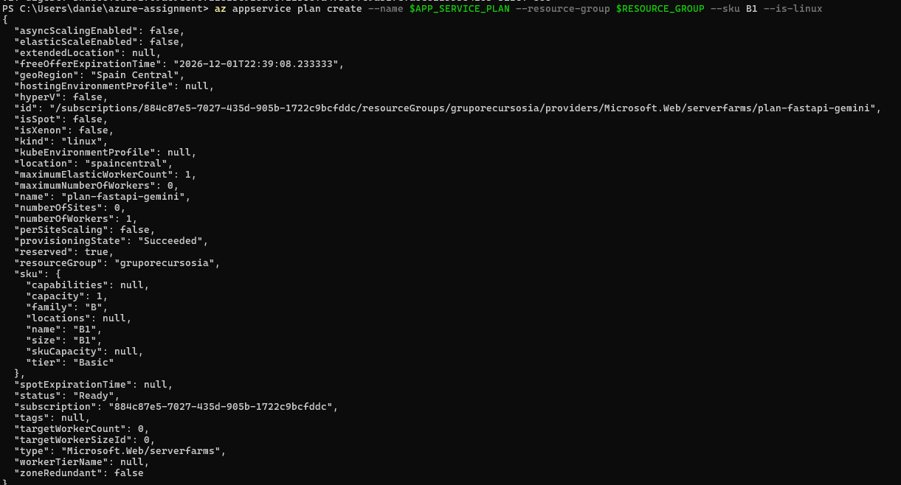

#### Paso 6: Despliegue de la Web App desde el ACR
Aprovisiona la Web App de contenedores configurando la imagen previamente cargada en el registro de Azure:

```powershell
# Crear la Web App con la imagen del contenedor de Azure
az webapp create --resource-group $RESOURCE_GROUP --plan $APP_SERVICE_PLAN --name $WEB_APP_NAME --deployment-container-image-name $IMAGE_TAG
```

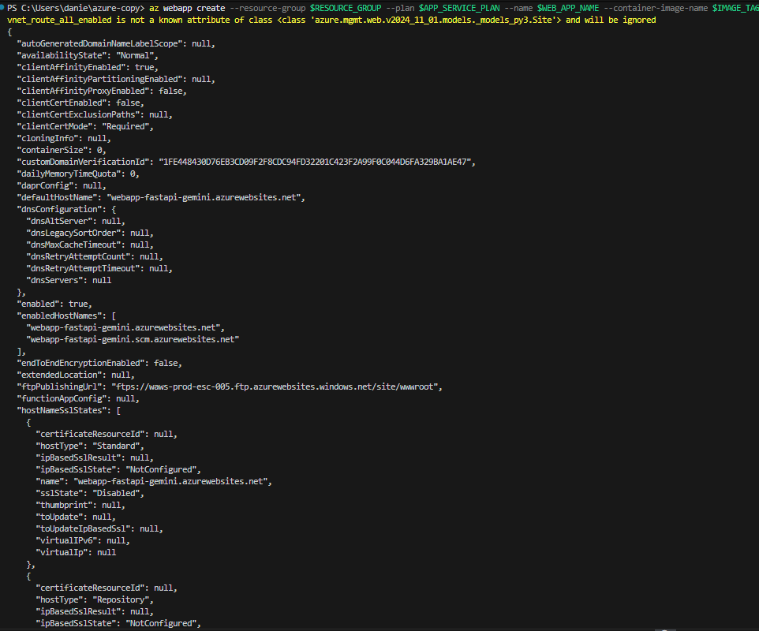

#### Paso 7: Configuración de Credenciales de Registro y Variables de Entorno
Configura la autenticación del App Service contra el ACR para que pueda descargar las actualizaciones de la imagen y define los secretos de la aplicación:

```powershell
# Leer la API Key desde el archivo .env
$GEMINI_API_KEY = (Get-Content .env | Select-String "GEMINI_API_KEY" | ForEach-Object { $_.ToString().Split("=",2)[1] })

# Vincular las credenciales del registro privado a la Web App (usando parámetros actualizados)
az webapp config container set --name $WEB_APP_NAME --resource-group $RESOURCE_GROUP --docker-custom-image-name $IMAGE_TAG --container-registry-url "https://$ACR_NAME.azurecr.io" --container-registry-user $ACR_NAME --container-registry-password $ACR_PASSWORD

# Definir la API Key de Gemini y forzar el puerto 8080 dentro del contenedor
az webapp config appsettings set --resource-group $RESOURCE_GROUP --name $WEB_APP_NAME --settings WEBSITES_PORT=8080 GEMINI_API_KEY=$GEMINI_API_KEY
```

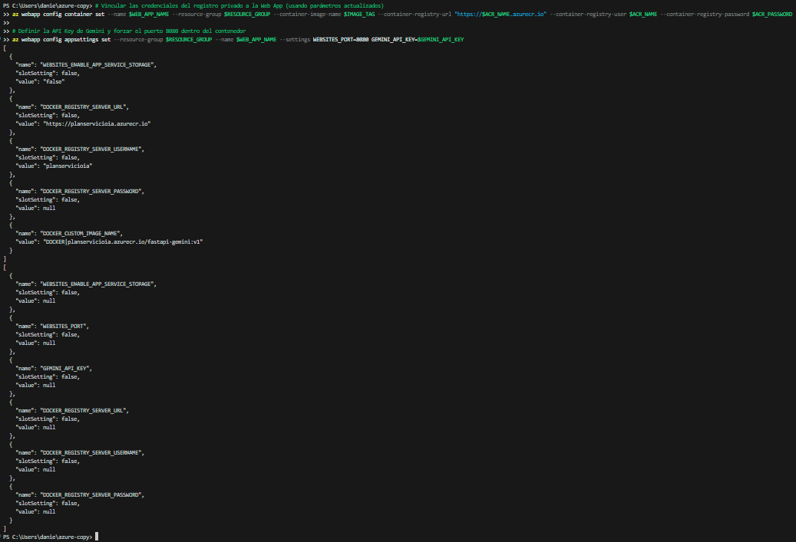

---

### 1.5. Verificación del Funcionamiento en Azure

Una vez que el despliegue haya completado su inicio en Azure, puedes probar el endpoint de generación ejecutando la siguiente llamada HTTP desde la consola:

```powershell
# Realizar petición de prueba a la API desplegada en Azure
# Opción A: usando la variable (requiere haberla definido antes en la sesión)
Invoke-WebRequest "https://$WEB_APP_NAME.azurewebsites.net/generate?prompt=Explain_PaaS_in_one_sentence" -UseBasicParsing

# Opción B: con la URL literal (funciona en cualquier sesión)
Invoke-WebRequest "https://webapp-fastapi-gemini.azurewebsites.net/generate?prompt=Explain_PaaS_in_one_sentence" -UseBasicParsing
```

#### Formato esperado de respuesta:
```json
{
  "prompt": "Explain_PaaS_in_one_sentence",
  "text": "Platform as a Service (PaaS) is a cloud computing model where a third-party provider delivers hardware and software tools—usually those needed for application development—to users over the internet."
}
```

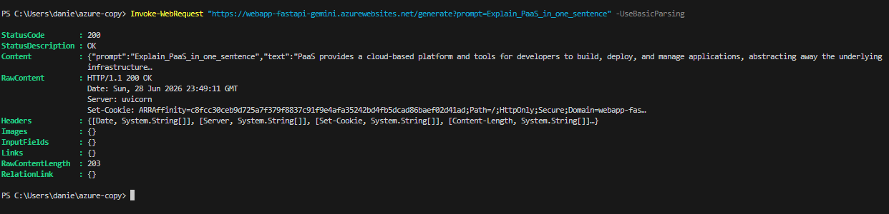

#### 1.5.1. Limpieza de Recursos y Control de Gastos

Para evitar que los recursos aprovisionados sigan consumiendo créditos de estudiante o facturando cargos adicionales, se recomienda gestionar el ciclo de vida de los servicios mediante una de las siguientes opciones:

Si deseas conservar la configuración de la Web App pero detener la ejecución del contenedor:
```powershell
# Detener la Web App
az webapp stop --name $WEB_APP_NAME --resource-group $RESOURCE_GROUP

# Volver a iniciar el servicio cuando sea necesario
az webapp start --name $WEB_APP_NAME --resource-group $RESOURCE_GROUP
```

## Bloque 2: Despliegue Docker Compose con Dos Contenedores

En esta segunda iteración, la aplicación se estructura en una arquitectura de múltiples contenedores coordinados por Docker Compose. Esta arquitectura divide el monolito en:
1. **Frontend API (Gateway):** Un contenedor FastAPI en el puerto 80 que recibe todas las peticiones externas y las redirige hacia la capa interna.
2. **Backend API:** El contenedor FastAPI original en el puerto 8080 que se comunica exclusivamente con la API de Gemini, protegido del exterior.

### 2.1. Estructura de Docker Compose

En la raíz del proyecto se ha introducido un archivo `docker-compose.yml` que orquesta ambos servicios. Este archivo ya cuenta con el nombre y URL de su ACR resueltos directamente en las imágenes, por lo que no requiere sustitución dinámica de variables:

```yaml
version: '3.8'

services:
  backend:
    build: ./backend
    image: planservicioia.azurecr.io/fastapi-backend:v1
    environment:
      - GEMINI_API_KEY=${GEMINI_API_KEY}
    expose:
      - "8080"

  frontend:
    build: ./frontend
    image: planservicioia.azurecr.io/fastapi-frontend:v1
    environment:
      - BACKEND_URL=http://backend:8080
    ports:
      - "80:80"
    depends_on:
      - backend
```

### 2.2. Pruebas Locales (Docker Compose)

En lugar de construir una sola imagen, utiliza compose para levantar el clúster entero simultáneamente:

> **⚠️ Prerequisito:** Comprueba que **Docker Desktop** está en ejecución antes de continuar (icono en la barra de tareas → *"Docker Desktop is running"*).

```powershell
# Leer la API Key desde el archivo .env
$env:GEMINI_API_KEY = (Get-Content .env | Select-String "GEMINI_API_KEY" | ForEach-Object { $_.ToString().Split("=",2)[1] })
docker-compose up --build -d
```
Verifique apuntando al puerto 80 (el cual ahora es gestionado por el Gateway frontend):
```powershell
Invoke-WebRequest "http://localhost:80/generate?prompt=Prueba_Compose"
```

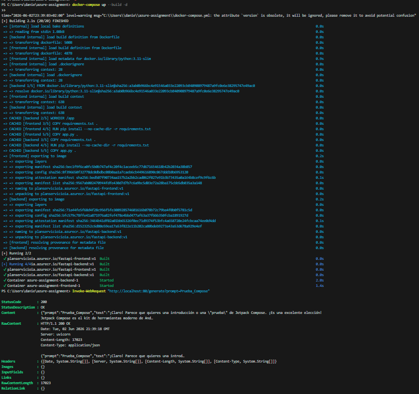

### 2.3. Despliegue en Azure App Service Multi-Container

Para desplegar la aplicación en Azure usando esta topología, los comandos a ejecutar cambian ligeramente. Si has iniciado una nueva sesión de terminal, redefine primero las variables necesarias:

```powershell
$RESOURCE_GROUP   = "gruporecursosia"
$LOCATION         = "spaincentral"
$ACR_NAME         = "planservicioia"
$APP_SERVICE_PLAN = "plan-fastapi-gemini"
$WEB_APP_NAME     = "webapp-fastapi-gemini"
$ACR_PASSWORD     = (az acr credential show --name $ACR_NAME --query "passwords[0].value" -o tsv)
```

**A. Construcción y subida de ambas imágenes al ACR**
```powershell
# Exportamos el nombre del ACR para los tags del Compose
$env:ACR_NAME=$ACR_NAME

# Autenticarse en el ACR antes de hacer push
docker login "$ACR_NAME.azurecr.io" --username $ACR_NAME --password $ACR_PASSWORD

# Construimos y subimos las imágenes
docker-compose build
docker-compose push
```


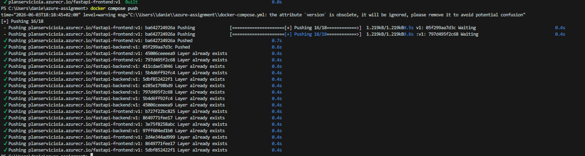


**B. Aprovisionamiento de la Web App en modo Multi-Container**
```powershell
# Crear el App Service Plan (si no lo tienes creado del ejercicio anterior)
az appservice plan create --name $APP_SERVICE_PLAN --resource-group $RESOURCE_GROUP --sku B1 --is-linux

# Crear la Web App pasándole el docker-compose.yml directamente
az webapp create --resource-group $RESOURCE_GROUP --plan $APP_SERVICE_PLAN --name $WEB_APP_NAME --multicontainer-config-type compose --multicontainer-config-file docker-compose.yml
```

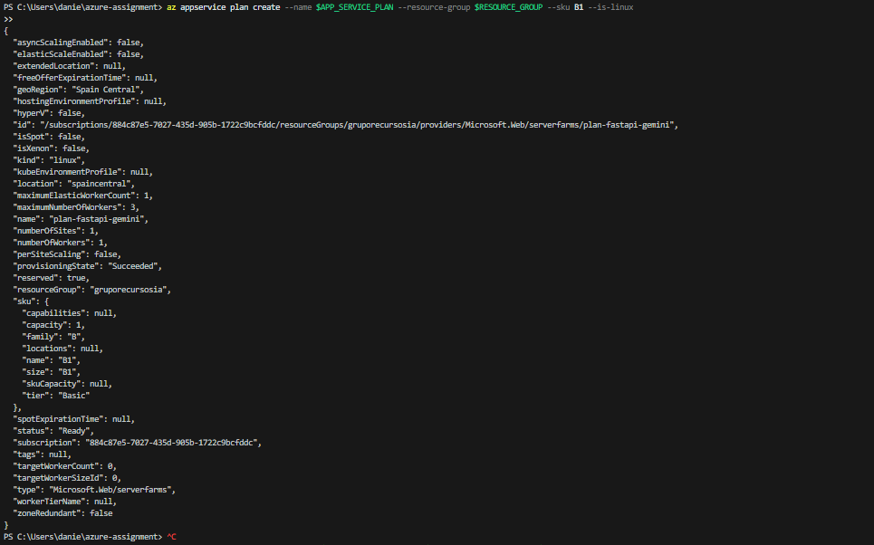
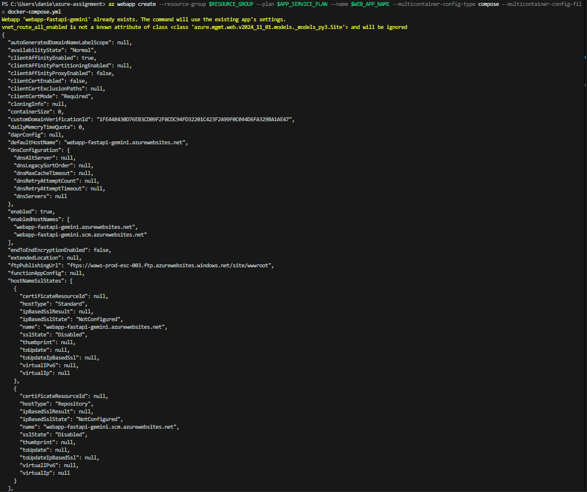

**C. Configuración de Variables en Azure**
```powershell
# Vincular las credenciales del ACR a la Web App (usando parámetros actualizados)
az webapp config container set --name $WEB_APP_NAME --resource-group $RESOURCE_GROUP --container-registry-url "https://$ACR_NAME.azurecr.io" --container-registry-user $ACR_NAME --container-registry-password $ACR_PASSWORD

# Leer la API Key desde el archivo .env
$GEMINI_API_KEY = (Get-Content .env | Select-String "GEMINI_API_KEY" | ForEach-Object { $_.ToString().Split("=",2)[1] })

# Definir la API Key de Gemini
az webapp config appsettings set --resource-group $RESOURCE_GROUP --name $WEB_APP_NAME --settings GEMINI_API_KEY=$GEMINI_API_KEY

# Configurar el puerto público: Indicamos a Azure que envíe el tráfico al puerto 80 (Frontend)
az webapp config appsettings set --resource-group $RESOURCE_GROUP --name $WEB_APP_NAME --settings WEBSITES_PORT=80

# Configurar comunicación interna: En Azure Multi-container los contenedores se comunican por localhost
az webapp config appsettings set --resource-group $RESOURCE_GROUP --name $WEB_APP_NAME --settings BACKEND_URL="http://localhost:8080"

# Iniciar la Web App (asegura el arranque si la aplicación está detenida)
az webapp start --name $WEB_APP_NAME --resource-group $RESOURCE_GROUP
```

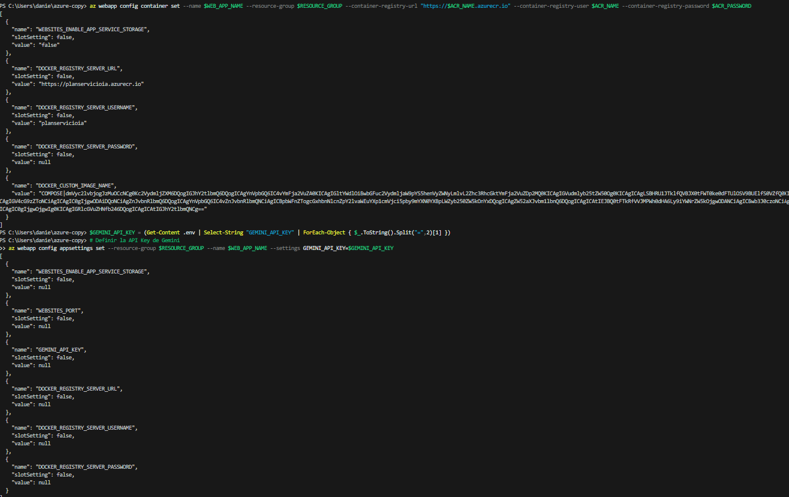
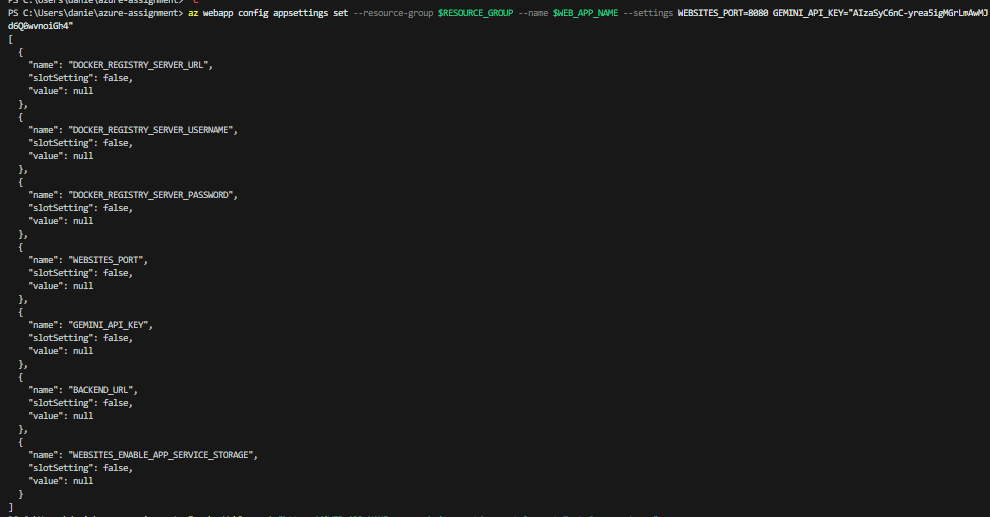

**D. Prueba del Despliegue en Azure**
Una vez que App Service haya descargado las imágenes y levantado los contenedores (esto puede tomar 2-3 minutos la primera vez), puedes probar que el flujo multi-contenedor funciona haciendo una llamada a tu dominio `.azurewebsites.net`:

```powershell
# Realizar petición de prueba a la API Frontend desplegada
Invoke-WebRequest "https://$WEB_APP_NAME.azurewebsites.net/generate?prompt=Test_Compose_Azure" -UseBasicParsing
```

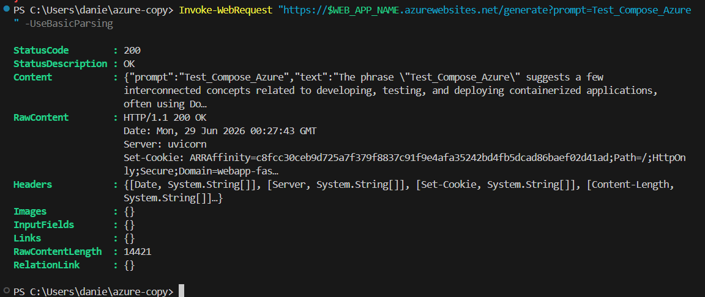

*(Nota: Si obtienes un error inicial o un tiempo de espera agotado, espera un par de minutos a que los contenedores terminen de arrancar o ejecuta `az webapp restart --name $WEB_APP_NAME --resource-group $RESOURCE_GROUP` para forzar un reinicio).*

*(Nota para actualizaciones: Si realizas modificaciones en el archivo `docker-compose.yml` localmente y deseas subirlas a Azure, debes volver a cargar la configuración en la Web App ejecutando: `az webapp config container set --resource-group $RESOURCE_GROUP --name $WEB_APP_NAME --multicontainer-config-type compose --multicontainer-config-file docker-compose.yml`).*


### 2.4. Solución de Problemas y Cambios de Código (Troubleshooting)

Durante la migración a la arquitectura multi-contenedor, nos encontramos con varios errores que requirieron los siguientes ajustes en el código y en Azure:

#### 1. Tolerancia a fallos en el Backend (`backend/app.py`)
**Problema:** Si la variable `GEMINI_API_KEY` no se pasaba correctamente (o tardaba en inyectarse), la llamada a `genai.Client()` fallaba y el contenedor `backend` fallaba de forma abrupta en el arranque, provocando que el Frontend no pudiera conectarse.
**Solución:** Se envolvió la inicialización en un bloque `try/except` para que el contenedor siempre arranque y devuelva el error de forma controlada al usuario.
```python
try:
    client = genai.Client()
except Exception as e:
    client = None
    print(f"Warning: genai.Client initialization failed: {e}")
```

#### 2. Timeout y Traza de Errores en Frontend (`frontend/app.py`)
**Problema:** Las peticiones desde el frontend al backend sufrían timeouts silenciosos si Gemini tardaba en responder, devolviendo un error `{"detail": ""}` incomprensible.
**Solución:** Se añadió un `timeout=60.0` explícito en `httpx.AsyncClient(timeout=60.0)` y se cambió la captura de excepciones para usar `repr(e)` y devolver detalles claros:
```python
    except Exception as e:
        raise HTTPException(status_code=500, detail=repr(e))
```

#### 3. Soporte de variables en Docker Compose (Azure App Service)
**Problema:** Azure App Service Multi-container no soporta el formato `${ACR_NAME}` en la propiedad `image:` del archivo de compose (provocaba el error `Application Error`).
**Solución:** Se hardcodearon directamente los nombres de imagen en el `docker-compose.yml` con el valor del ACR (`planservicioia.azurecr.io/...`), eliminando la dependencia de variables dinámicas en tiempo de despliegue.

#### 4. Enrutamiento del puerto público en Azure
**Problema:** En el despliegue de un solo contenedor, Azure enrutaba el tráfico al puerto 8080 (`WEBSITES_PORT=8080`). Al cambiar a multi-contenedor, nuestro nuevo Frontend público escucha por el puerto 80, provocando un fallo en el balanceador.
**Solución:** Se forzó el reseteo de la variable `WEBSITES_PORT` para redirigir el tráfico externo correctamente al puerto 80.
```powershell
az webapp config appsettings set --resource-group $RESOURCE_GROUP --name $WEB_APP_NAME --settings WEBSITES_PORT=80
```

#### 5. Comunicación de red interna entre contenedores en Azure
**Problema:** Localmente los contenedores se comunicaban vía `http://backend:8080`, pero en Azure fallaba con `ConnectError`. Esto ocurre porque Azure Web App For Containers (Compose) hace que todos los contenedores compartan el mismo espacio de red (namespaces).
**Solución:** Se modificó la URL del backend en Azure para que el Frontend llamara a `localhost` en lugar del nombre del servicio.
```powershell
az webapp config appsettings set --resource-group $RESOURCE_GROUP --name $WEB_APP_NAME --settings BACKEND_URL="http://localhost:8080"
```

#### 6. Extracción y análisis de logs en Azure
**Problema:** Durante los errores `:( Application Error`, la consola local no provee información de por qué fallaron los contenedores en el despliegue.
**Solución:** Usamos comandos de la CLI de Azure para diagnosticar qué ocurría internamente. Para descargar todos los logs como un archivo ZIP local usamos:
```powershell
az webapp log download --name $WEB_APP_NAME --resource-group $RESOURCE_GROUP
```
Adicionalmente, para ver los logs en tiempo real por la consola (muy útil durante arranques lentos o reinicios):
```powershell
az webapp log tail --name $WEB_APP_NAME --resource-group $RESOURCE_GROUP
```

## Bloque 3: Despliegue Compose con Persistencia

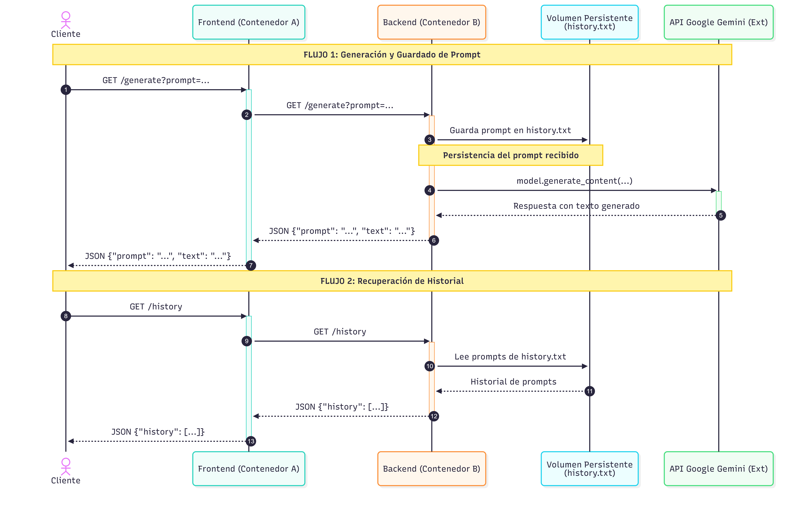

Para asegurar que las consultas realizadas a la aplicación no se pierdan cuando se reinician los contenedores o se vuelve a desplegar el servicio en la nube, se ha implementado un mecanismo de almacenamiento persistente montando un recurso compartido de archivos de Azure (Azure File Share) directamente en los contenedores.

El servicio Backend guarda cada prompt en formato de texto plano dentro de la ruta `/app/data/history.txt`. Esta ruta está mapeada a un almacenamiento externo y permanente.

### 3.1. Aprovisionamiento de Azure Files y Conexión con la Web App

Sigue estos pasos en la terminal PowerShell para crear el almacenamiento persistente y conectarlo a tu Web App:

##### Paso 1: Definir variables de entorno adicionales
```powershell
# Variables del entorno de Azure (redefinir si es una sesión de terminal nueva)
$RESOURCE_GROUP  = "gruporecursosia"
$LOCATION        = "spaincentral"
$WEB_APP_NAME    = "webapp-fastapi-gemini"

# Variables para el almacenamiento persistente
$STORAGE_ACCOUNT = "almacenamientoappia" # Debe ser un nombre único globalmente
$SHARE_NAME      = "archivos-texto"
$MOUNT_PATH      = "/app/data" # Ruta dentro del contenedor donde se guardará el historial
```

##### Paso 2: Crear la Infraestructura de Almacenamiento
```powershell
# 1. Crear la Cuenta de Almacenamiento (Storage Account)
az storage account create --name $STORAGE_ACCOUNT --resource-group $RESOURCE_GROUP --location $LOCATION --sku Standard_LRS

# 2. Crear el recurso compartido de archivos (File Share)
az storage share-rm create --resource-group $RESOURCE_GROUP --storage-account $STORAGE_ACCOUNT --name $SHARE_NAME --quota 5
```

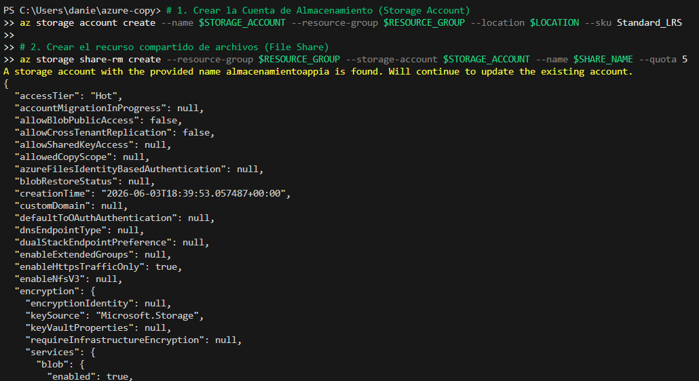

##### Paso 3: Conectar el Almacenamiento a la Web App
```powershell
# 1. Obtener la clave de acceso del Storage Account
$STORAGE_KEY = (az storage account keys list --resource-group $RESOURCE_GROUP --account-name $STORAGE_ACCOUNT --query "[0].value" --output tsv)

# 2. (Opcional) Eliminar un montaje previo con el mismo ID si existe
az webapp config storage-account delete --resource-group $RESOURCE_GROUP --name $WEB_APP_NAME --custom-id AlmacenamientoPersistente

# 3. (Opcional) Limpiar el historial previo en la nube para empezar con una demo limpia (si no existe el archivo, dará error, el cual se puede ignorar)
az storage file delete --share-name $SHARE_NAME --account-name $STORAGE_ACCOUNT --account-key $STORAGE_KEY --path history.txt

# 4. Montar el almacenamiento persistente en la Web App
az webapp config storage-account add --resource-group $RESOURCE_GROUP --name $WEB_APP_NAME --custom-id AlmacenamientoPersistente --storage-type AzureFiles --account-name $STORAGE_ACCOUNT --share-name $SHARE_NAME --access-key $STORAGE_KEY --mount-path $MOUNT_PATH

# 4. Reiniciar la Web App para que el montaje surta efecto
az webapp restart --name $WEB_APP_NAME --resource-group $RESOURCE_GROUP
```

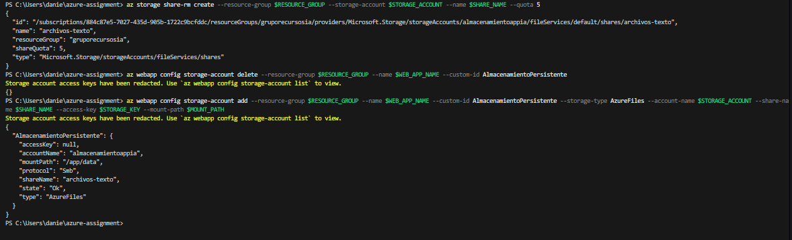

---

### 3.2. Ajuste al Docker Compose (`docker-compose.yml`)

Para soportar las pruebas y persistencia en local, se actualiza el `docker-compose.yml` añadiendo el volumen persistente al servicio `backend` y etiquetando las imágenes como `v2`. El archivo completo queda así:

```yaml
version: '3.8'

services:
  backend:
    build: ./backend
    image: planservicioia.azurecr.io/fastapi-backend:v2
    environment:
      - GEMINI_API_KEY=${GEMINI_API_KEY}
    expose:
      - "8080"
    volumes:
      - AlmacenamientoPersistente:/app/data

  frontend:
    build: ./frontend
    image: planservicioia.azurecr.io/fastapi-frontend:v2
    environment:
      - BACKEND_URL=http://backend:8080
    ports:
      - "80:80"
    depends_on:
      - backend

volumes:
  AlmacenamientoPersistente:
```
* **En Local:** docker-compose crea y gestiona automáticamente un volumen local llamado `AlmacenamientoPersistente` que se monta en `/app/data` y persiste los datos de tus consultas.
* **En Azure:** Azure App Service intercepta el nombre del volumen (`AlmacenamientoPersistente`) y lo asocia automáticamente con el montaje de Azure Files que tiene el mismo `custom-id` (Paso 3), guardando el archivo de texto directamente en la cuenta de almacenamiento en la nube sin depender del almacenamiento efímero del contenedor.

---

### 3.3. Pruebas de Persistencia en Local

> **⚠️ Prerequisito:** Comprueba que **Docker Desktop** está en ejecución antes de continuar (icono en la barra de tareas → *"Docker Desktop is running"*).

1. Levanta los contenedores en local:
   ```powershell
   docker-compose up --build -d
   ```
2. Envía prompts de prueba al endpoint público de generación (puerto 80):
   ```powershell
   Invoke-WebRequest "http://localhost:80/generate?prompt=Local_Prompt_1" -UseBasicParsing
   Invoke-WebRequest "http://localhost:80/generate?prompt=Local_Prompt_2" -UseBasicParsing
   ```
3. Verifica que se ha creado el historial accediendo al endpoint `/history`:
   ```powershell
   (Invoke-WebRequest "http://localhost:80/history" -UseBasicParsing).Content
   # Salida esperada: {"history":["Local_Prompt_1"]}
   ```

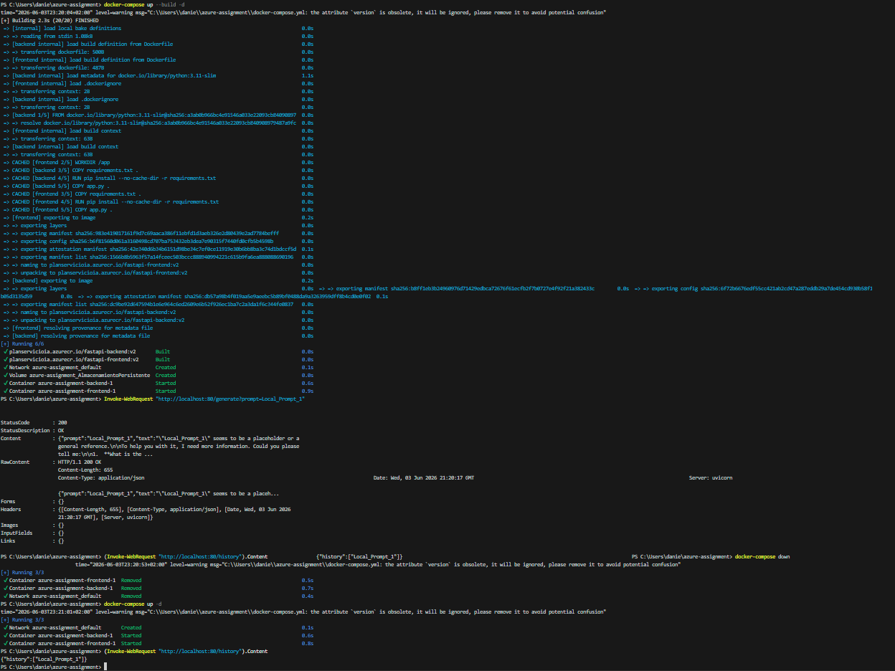

4. Detén y elimina por completo los contenedores:
   ```powershell
   docker-compose down
   ```
5. Vuelve a levantar el servicio:
   ```powershell
   docker-compose up -d
   ```
6. Consulta nuevamente el historial.
   ```powershell
   (Invoke-WebRequest "http://localhost:80/history" -UseBasicParsing).Content
   # Salida esperada: {"history":["Local_Prompt_1"]}
   ```
Los datos deben seguir presentes puesto que están guardados en el archivo `./data/history.txt` de tu equipo local y sobreviven a la recreación de los contenedores.

---

### 3.4. Pruebas de Persistencia en Azure

1. Reconstruye y sube las imágenes al ACR con los nuevos cambios de código:
   ```powershell
   $env:ACR_NAME=$ACR_NAME
   docker-compose build
   docker-compose push
   ```
2. Actualiza la configuración de la Web App con el nuevo `docker-compose.yml` (que incluye el volumen) y fuerza el reinicio:
   ```powershell
   # Subir la nueva configuración del compose a Azure (incluye el volumen en backend)
   az webapp config container set --resource-group $RESOURCE_GROUP --name $WEB_APP_NAME --multicontainer-config-type compose --multicontainer-config-file docker-compose.yml

   # Reiniciar para descargar las nuevas imágenes y aplicar el montaje
   az webapp restart --name $WEB_APP_NAME --resource-group $RESOURCE_GROUP
   ```
3. Envía una consulta a la Web App en la nube:
   ```powershell
   Invoke-WebRequest "https://webapp-fastapi-gemini.azurewebsites.net/generate?prompt=Azure_Prompt_1" -UseBasicParsing
   ```
4. Consulta el endpoint de historial para comprobar que ha registrado la consulta:
   ```powershell
   (Invoke-WebRequest "https://webapp-fastapi-gemini.azurewebsites.net/history" -UseBasicParsing).Content
   # Salida esperada: {"history":["Azure_Prompt_1"]}
   ```

5. (Opcional) Verifica la persistencia listando los archivos en Azure File Share directamente mediante Azure CLI:
   ```powershell
   # Listar archivos en el File Share
   az storage file list --share-name $SHARE_NAME --account-name $STORAGE_ACCOUNT --account-key $STORAGE_KEY --output table

   # Descargar y mostrar el contenido de history.txt
   az storage file download --share-name $SHARE_NAME --account-name $STORAGE_ACCOUNT --account-key $STORAGE_KEY --path history.txt --dest .
   Get-Content history.txt
   Remove-Item history.txt
   ```

6. Forza un reinicio de la Web App en Azure para simular un fallo o actualización del servicio:
   ```powershell
   az webapp restart --name $WEB_APP_NAME --resource-group $RESOURCE_GROUP
   ```
7. Vuelve a realizar la consulta al historial:
   ```powershell
   (Invoke-WebRequest "https://webapp-fastapi-gemini.azurewebsites.net/history" -UseBasicParsing).Content
   ```
   **Resultado:** El endpoint debe seguir devolviendo `{"history":["Azure_Prompt_1"]}` demostrando que el archivo se almacena en el volumen persistente de Azure Files y no se pierde tras reiniciar el servicio.

   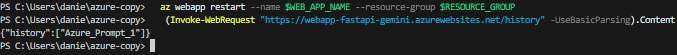

   *(Nota: Es posible que aparezcan más entradas en la lista del historial si ya habías lanzado peticiones de prueba anteriormente).*

---

## Bloque 4: Despliegue Final con Persistencia y Prueba de Interconexión

### 4.1. Diagrama de Arquitectura Final

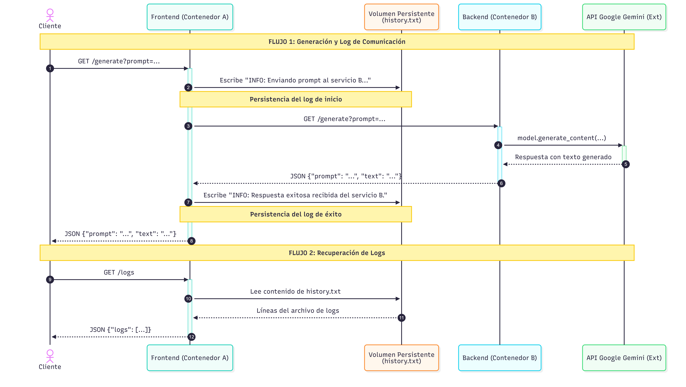

En esta nueva iteración de la arquitectura (imágenes etiquetadas con la versión `v3`), se ha modificado la demostración de la comunicación de red entre contenedores de la siguiente forma:

1. **Reemplazo de `/history`:** Se eliminó la anterior funcionalidad de historial de prompts que gestionaba el Backend en `history.txt`.
2. **Generación de Logs en Frontend:** Ahora, el Frontend (Contenedor A) usa la librería estándar `logging` de Python para registrar cada comunicación con el Backend (Contenedor B) en el archivo `history.txt`.
3. **Endpoint `/logs`:** Se habilitó un nuevo endpoint en el Frontend (`GET /logs`) para leer de forma local el archivo de logs `history.txt` y retornar los registros del flujo de peticiones.
4. **Reubicación de Volumen:** El volumen persistente `AlmacenamientoPersistente` ha sido reubicado en el Frontend para conservar el historial de logs ante reinicios.

### 4.2. Configuración en docker-compose (Versión v3)

El archivo `docker-compose.yml` actualiza las imágenes a la versión `v3` y traslada el volumen persistente al servicio `frontend`:

```yaml
version: '3.8'

services:
  backend:
    build: ./backend
    image: planservicioia.azurecr.io/fastapi-backend:v3
    environment:
      - GEMINI_API_KEY=${GEMINI_API_KEY}
    expose:
      - "8080"

  frontend:
    build: ./frontend
    image: planservicioia.azurecr.io/fastapi-frontend:v3
    environment:
      - BACKEND_URL=http://backend:8080
    ports:
      - "80:80"
    depends_on:
      - backend
    volumes:
      - AlmacenamientoPersistente:/app/data

volumes:
  AlmacenamientoPersistente:
```

### 4.3. Definición de los Contenedores (Dockerfiles)

Para la construcción de los contenedores de Frontend y Backend de esta arquitectura final, se utilizan los siguientes archivos `Dockerfile`:

#### Backend (`backend/Dockerfile`)
```dockerfile
# Use official Python slim image
FROM python:3.11-slim

# Set working directory
WORKDIR /app

# Copy requirements.txt first to leverage Docker cache
COPY requirements.txt .

# Install all dependencies from requirements.txt
RUN pip install --no-cache-dir -r requirements.txt

# Copy the FastAPI app
COPY app.py .

# Expose FastAPI port
EXPOSE 8080

# Run the app with Uvicorn
CMD ["uvicorn", "app:app", "--host", "0.0.0.0", "--port", "8080"]
```

#### Frontend (`frontend/Dockerfile`)
```dockerfile
# Use official Python slim image
FROM python:3.11-slim

# Set working directory
WORKDIR /app

# Copy requirements.txt first to leverage Docker cache
COPY requirements.txt .

# Install all dependencies from requirements.txt
RUN pip install --no-cache-dir -r requirements.txt

# Copy the FastAPI app
COPY app.py .

# Expose FastAPI port
EXPOSE 80

# Run the app with Uvicorn on port 80
CMD ["uvicorn", "app:app", "--host", "0.0.0.0", "--port", "80"]
```

### 4.4. Pruebas de Logs y Persistencia en Local

> **⚠️ Prerequisito:** Comprueba que **Docker Desktop** está en ejecución antes de continuar (icono en la barra de tareas → *"Docker Desktop is running"*).

1. Reconstruye y levanta los contenedores con las imágenes `v3`:
   ```powershell
   # Leer la API Key desde el archivo .env
   $env:GEMINI_API_KEY = (Get-Content .env | Select-String "GEMINI_API_KEY" | ForEach-Object { $_.ToString().Split("=",2)[1] })
   docker-compose up --build -d
   ```
2. Envía una consulta de prueba al frontend (puerto 80):
   ```powershell
   Invoke-WebRequest "http://localhost:80/generate?prompt=Test_Communication_Logs"
   ```
3. Verifica la traza de logs de comunicación a través del endpoint `/logs`:
   ```powershell
   (Invoke-WebRequest "http://localhost:80/logs").Content
   ```
   **Salida esperada (en formato JSON):**
   ```json
   {
     "logs": [
       "2026-06-04 20:50:44,123 - INFO - Enviando prompt al servicio B en la URL http://backend:8080/generate",
       "2026-06-04 20:50:44,456 - INFO - Respuesta exitosa recibida del servicio B."
     ]
   }
   ```

   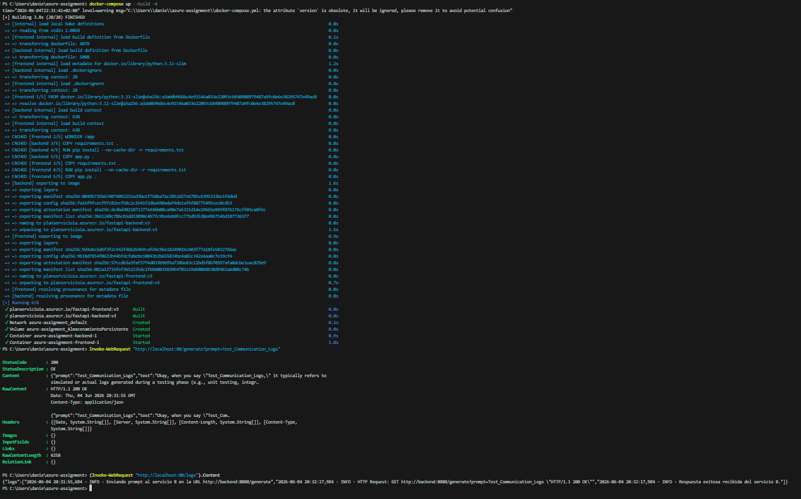

4. Detén y elimina por completo los contenedores para validar la persistencia:
   ```powershell
   docker-compose down
   ```
5. Vuelve a iniciar los contenedores (esta vez sin reconstruir la imagen):
   ```powershell
   docker-compose up -d
   ```
6. Consulta nuevamente el endpoint de logs:
   ```powershell
   (Invoke-WebRequest "http://localhost:80/logs" -UseBasicParsing).Content
   ```
   **Resultado:** El endpoint debe seguir devolviendo los registros de logs previos (`"INFO - Enviando prompt..."` y `"INFO - Respuesta exitosa..."`), demostrando que el archivo se almacena en el volumen persistente `AlmacenamientoPersistente` en tu equipo local y sobrevive a la recreación de los contenedores.

   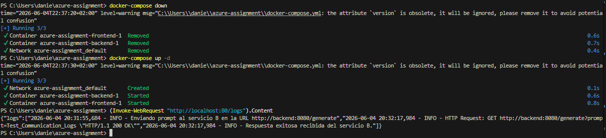

### 4.5. Instrucciones de Despliegue en Azure (v3)

Para desplegar esta nueva configuración (imágenes `v3` y persistencia en el Frontend) en Azure, ejecuta los siguientes comandos en tu terminal de PowerShell:

**A. Construcción y subida de las nuevas imágenes v3**
```powershell
# Exportamos el nombre del ACR para etiquetar las imágenes v3
$env:ACR_NAME=$ACR_NAME

# Autenticarse en el ACR antes de hacer push (usando password-stdin por seguridad)
echo $ACR_PASSWORD | docker login "$ACR_NAME.azurecr.io" --username $ACR_NAME --password-stdin

# Construimos y subimos las imágenes
docker-compose build
docker-compose push
```

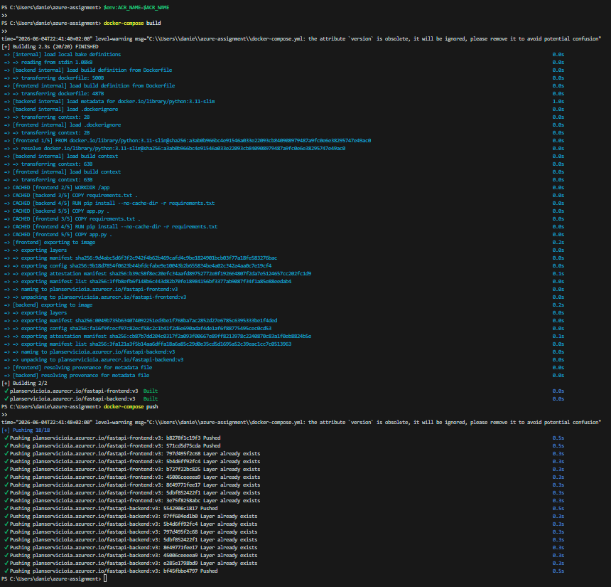

**B. Actualización de la Web App en Azure**
```powershell
# Definir variables de entorno (por si inicias una nueva sesión de terminal)
$RESOURCE_GROUP  = "gruporecursosia"
$ACR_NAME        = "planservicioia"
$WEB_APP_NAME    = "webapp-fastapi-gemini"
$STORAGE_ACCOUNT = "almacenamientoappia"
$SHARE_NAME      = "archivos-texto"
$ACR_PASSWORD    = (az acr credential show --name $ACR_NAME --query "passwords[0].value" -o tsv)
$STORAGE_KEY     = (az storage account keys list --resource-group $RESOURCE_GROUP --account-name $STORAGE_ACCOUNT --query "[0].value" --output tsv)

# Forzar a Azure a leer la nueva configuración del docker-compose.yml con las imágenes v3
az webapp config container set --resource-group $RESOURCE_GROUP --name $WEB_APP_NAME --multicontainer-config-type compose --multicontainer-config-file docker-compose.yml

# Reconectar las credenciales del ACR a la Web App (necesario tras actualizar el compose, usando parámetros actualizados)
az webapp config container set --name $WEB_APP_NAME --resource-group $RESOURCE_GROUP `
  --container-registry-url "https://$ACR_NAME.azurecr.io" `
  --container-registry-user $ACR_NAME `
  --container-registry-password $ACR_PASSWORD

# Leer la API Key desde el archivo .env
$GEMINI_API_KEY = (Get-Content .env | Select-String "GEMINI_API_KEY" | ForEach-Object { $_.ToString().Split("=",2)[1] })

# Configurar variables de entorno: API Key, puerto público y URL interna del backend
az webapp config appsettings set --resource-group $RESOURCE_GROUP --name $WEB_APP_NAME `
  --settings GEMINI_API_KEY=$GEMINI_API_KEY WEBSITES_PORT=80 BACKEND_URL="http://localhost:8080"
```

> **Nota:** Azure App Service Multi-container hace que todos los contenedores compartan el mismo espacio de red, por lo que el Frontend debe llamar al Backend mediante `http://localhost:8080` en lugar de `http://backend:8080` (nombre de servicio de Compose). Esto queda reflejado en la variable `BACKEND_URL`.

**C. Configuración del Almacenamiento Persistente en Azure**
Dado que el volumen `AlmacenamientoPersistente` ahora se monta sobre el Frontend (para guardar `history.txt`), Azure se encargará de mapear automáticamente el File Share al contenedor Frontend gracias al ID coincidente. Para asociarlo (eliminando previamente cualquier montaje con el mismo ID si existe):
```powershell
# 1. Eliminar un montaje previo con el mismo ID si existe
az webapp config storage-account delete --resource-group $RESOURCE_GROUP --name $WEB_APP_NAME --custom-id AlmacenamientoPersistente

# 2. (Opcional) Limpiar el historial previo en la nube para empezar con una demo limpia (si no existe el archivo, dará error, el cual se puede ignorar)
az storage file delete --share-name $SHARE_NAME --account-name $STORAGE_ACCOUNT --account-key $STORAGE_KEY --path history.txt

# 3. Asociar la cuenta de almacenamiento a la Web App
az webapp config storage-account add --resource-group $RESOURCE_GROUP --name $WEB_APP_NAME --custom-id AlmacenamientoPersistente --storage-type AzureFiles --account-name $STORAGE_ACCOUNT --share-name $SHARE_NAME --access-key $STORAGE_KEY --mount-path /app/data
```

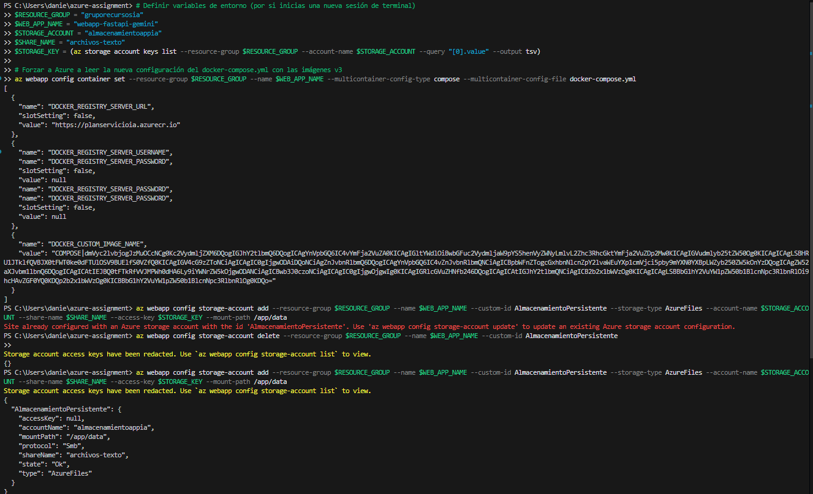

**D. Reinicio y Verificación**

Para comprobar la persistencia de los logs ante reinicios y recreaciones de los contenedores en la nube:

1. Realiza el reinicio inicial para aplicar la configuración de almacenamiento y descargar las nuevas imágenes (si la Web App está detenida, utiliza `start` en lugar de `restart`):
   ```powershell
   # Si el servicio ya está activo/corriendo:
   az webapp restart --name $WEB_APP_NAME --resource-group $RESOURCE_GROUP

   # Si el servicio se detuvo previamente:
   az webapp start --name $WEB_APP_NAME --resource-group $RESOURCE_GROUP
   ```

2. Envía una petición de generación de contenido (espera un par de minutos a que los contenedores hayan arrancado):
   ```powershell
   Invoke-WebRequest "https://webapp-fastapi-gemini.azurewebsites.net/generate?prompt=Azure_Prompt_v3" -UseBasicParsing
   ```
   *(Nota: Durante el periodo de arranque, es completamente normal y esperable que la petición falle inicialmente con un error de conexión `{"detail": "ConnectError('All connection attempts failed')"}` mientras el contenedor backend termina de iniciar. Espera uno o dos minutos y vuelve a realizar la llamada).*

3. Comprueba los logs en el nuevo endpoint para verificar el flujo de comunicación inicial:
   ```powershell
   (Invoke-WebRequest "https://webapp-fastapi-gemini.azurewebsites.net/logs" -UseBasicParsing).Content
   ```

4. (Opcional) Verifica que el archivo de logs se ha creado físicamente en el almacenamiento de Azure Files mediante CLI:
   ```powershell
   # Listar archivos en el File Share
   az storage file list --share-name $SHARE_NAME --account-name $STORAGE_ACCOUNT --account-key $STORAGE_KEY --output table

   # Descargar y ver el contenido de history.txt
   az storage file download --share-name $SHARE_NAME --account-name $STORAGE_ACCOUNT --account-key $STORAGE_KEY --path history.txt --dest .
   Get-Content history.txt
   Remove-Item history.txt
   ```

5. Fuerza un reinicio de la Web App en Azure para simular la destrucción y recreación de los contenedores:
   ```powershell
   az webapp restart --name $WEB_APP_NAME --resource-group $RESOURCE_GROUP
   ```

6. Realiza de nuevo la consulta al endpoint de logs (espera el arranque):
   ```powershell
   (Invoke-WebRequest "https://webapp-fastapi-gemini.azurewebsites.net/logs" -UseBasicParsing).Content
   ```
   **Resultado esperado:** El endpoint debe seguir devolviendo los registros de logs previos (`"INFO - Enviando prompt..."` e `"INFO - Respuesta exitosa..."`), demostrando que el historial persistió gracias al montaje de Azure Files.

   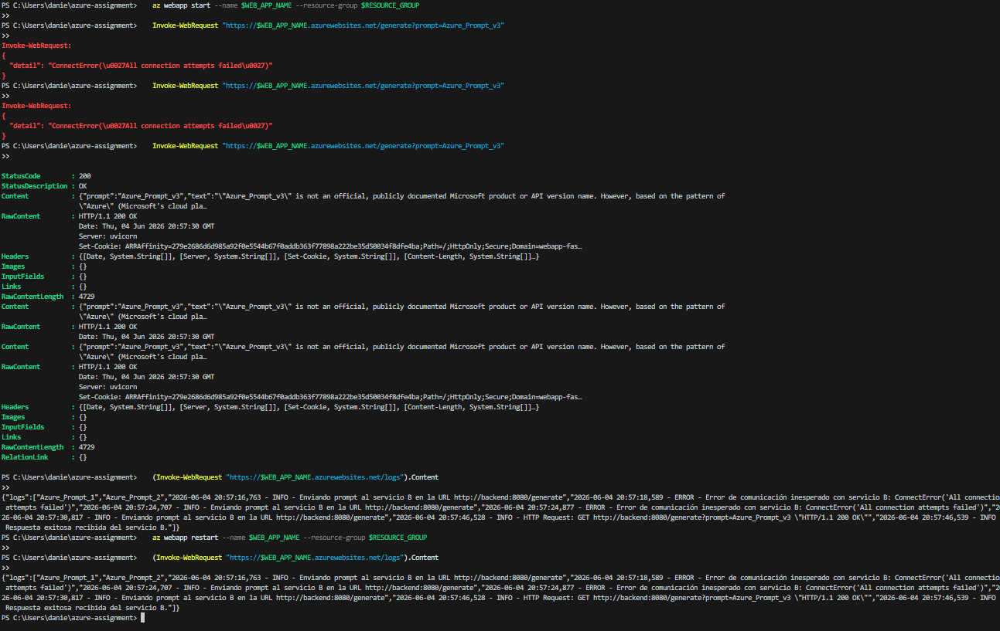

---

### 4.6. Control de Gastos y Limpieza de Recursos (Azure Cost Management)

Para evitar que los recursos aprovisionados sigan consumiendo saldo de tus créditos de estudiante o facturando importes adicionales tras haber finalizado la práctica, se aconseja gestionar la parada o eliminación del entorno con uno de los siguientes métodos:

#### Opción A: Detener la ejecución de la Web App (Conserva la configuración)
Si quieres pausar temporalmente el servicio (por ejemplo, para seguir haciendo pruebas en otro momento o para grabar el vídeo explicativo) deteniendo la ejecución de los contenedores:
```powershell
# Detener la Web App
az webapp stop --name $WEB_APP_NAME --resource-group $RESOURCE_GROUP

# Reanudar la Web App
az webapp start --name $WEB_APP_NAME --resource-group $RESOURCE_GROUP
```
> ⚠️ **Nota:** Ten en cuenta que si el Plan de App Service está en un tier de pago (como el SKU B1 recomendado para multi-contenedor), el coste del plan de hospedaje se seguirá cobrando por hora aunque la Web App esté detenida.

#### Opción B: Eliminar el Grupo de Recursos por completo (Recomendado al finalizar)
Si has completado toda la práctica y grabado el vídeo explicativo, la forma idónea de detener el gasto al 100% de manera definitiva es destruir el grupo de recursos completo. Esto eliminará de forma permanente la Web App, el App Service Plan, el Azure Container Registry (ACR) y la Storage Account:
```powershell
# Eliminar el grupo de recursos completo sin esperar confirmación interactiva
az group delete --name $RESOURCE_GROUP --yes --no-wait
```

---

## Referencias y Bibliografía

Para la elaboración de este despliegue y la configuración de los comandos utilizados a lo largo de la práctica, se han consultado las siguientes fuentes de documentación oficial:

### Documentación de Azure CLI (Microsoft Learn):
* [az login (Autenticación en Azure)](https://learn.microsoft.com/cli/azure/reference-index#az-login)
* [az group (Administración de Grupos de Recursos)](https://learn.microsoft.com/cli/azure/group)
* [az acr (Gestión de Azure Container Registry)](https://learn.microsoft.com/cli/azure/acr)
* [az acr credential (Obtención de Credenciales del Registro)](https://learn.microsoft.com/cli/azure/acr/credential)
* [az appservice plan (Configuración de Planes de App Service)](https://learn.microsoft.com/cli/azure/appservice/plan)
* [az webapp (Creación y Gestión de Web Apps)](https://learn.microsoft.com/cli/azure/webapp)
* [az webapp config container (Configuración de Contenedores en Web Apps)](https://learn.microsoft.com/cli/azure/webapp/config/container)
* [az webapp config appsettings (Definición de Variables de Entorno y Configuración)](https://learn.microsoft.com/cli/azure/webapp/config/appsettings)
* [az webapp config storage-account (Montaje de Almacenamiento en Web Apps)](https://learn.microsoft.com/cli/azure/webapp/config/storage-account)
* [az webapp log (Descarga y Seguimiento de Logs en Tiempo Real)](https://learn.microsoft.com/cli/azure/webapp/log)
* [az storage account (Gestión de Cuentas de Almacenamiento)](https://learn.microsoft.com/cli/azure/storage/account)
* [az storage share-rm (Gestión de Recursos Compartidos de Azure Files)](https://learn.microsoft.com/cli/azure/storage/share-rm)

### Documentación de Docker:
* [Referencia de la Línea de Comandos de Docker (build, push, run, login)](https://docs.docker.com/engine/reference/commandline/cli/)
* [Guía de Referencia del Archivo Dockerfile](https://docs.docker.com/engine/reference/builder/)
* [Docker Compose — Referencia de la CLI (up, down, build, push)](https://docs.docker.com/compose/reference/)
* [Docker Compose — Especificación del Archivo docker-compose.yml](https://docs.docker.com/compose/compose-file/)

### PowerShell:
* [Invoke-WebRequest (Cmdlet para peticiones HTTP)](https://learn.microsoft.com/powershell/module/microsoft.powershell.utility/invoke-webrequest)

### Librerías y SDKs:
* [Documentación Oficial de FastAPI (Framework Web)](https://fastapi.tiangolo.com/)
* [SDK de Google GenAI para Python (Gemini 2.5)](https://github.com/googleapis/python-genai)
* [httpx — Cliente HTTP asíncrono para Python](https://www.python-httpx.org/)

---

## Anexo: Enlaces del Proyecto

A continuación se facilitan los enlaces correspondientes al repositorio de código fuente y a la demostración del despliegue:

* **Repositorio de GitHub:** [danielquinti/azure-assignment](https://github.com/danielquinti/azure-assignment)
* **Prueba de Despliegue (Vídeo):** [Demostración en vídeo de la práctica (SharePoint)](https://udcgal-my.sharepoint.com/:v:/g/personal/daniel_quintillan_udc_es/IQAZx4uVDzvRSLAc_VQAiSLoAaY_CBG_JocwCdQYRb9-5mE?e=e3HjUF)
